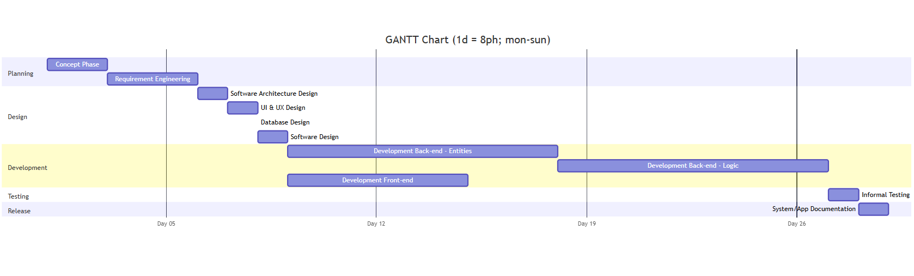
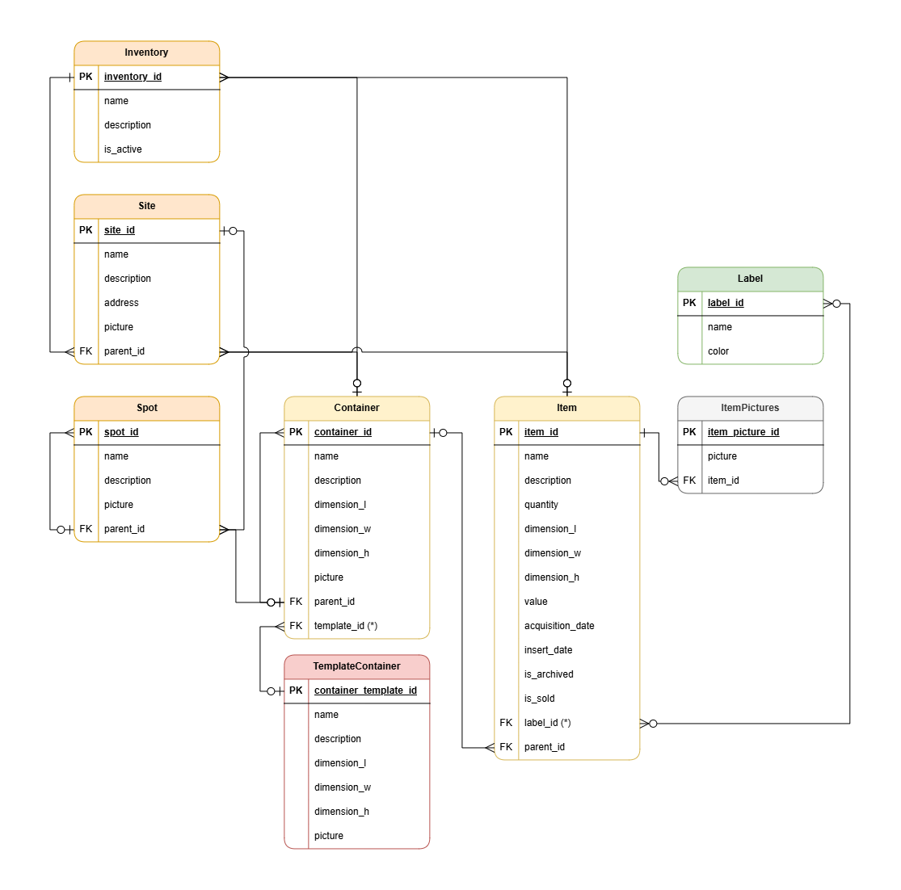
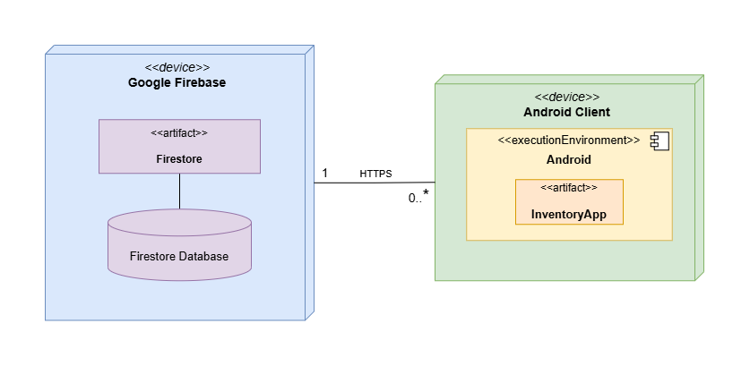

# Development Documentation Log

In this Document I will explain and document all the activities concerning the development of InventoryApp.

InventoryApp is 1-person personal project, therefore this log also serves to prove my skills, knowledge and application ability of Software Engineering processes and best-practices in the case of a from-scratch full-stack software development project.

As to keep a more formal technical style, most of this document is written a-personally, but should always be interpreted in first-person as I am the only developer on the project.

__Unless stated otherwise, all the Templates for the various documents and all the additional Conventions have been created and written by me.__

## Project Setting and Configuration

Phase of the project where the initial configurations are set, conventions and items for both VCS and ALM are defined and the structure of the first documentation documents is created.

### GitFlow

The Version Control System (VCS) of the project is Git, the Distributed VCS (the Remote Repository) is GitHub.

The project uses Git by following the GitFlow model. All the practices and conventions of GitFlow are followed, and some even more restrictive conventions have been defined to further improve the project's Version Control organization and management.

The Persistent Branches of the project are:
- `main`: the Main Branch, where the production-ready code is stored.
- `dev`: the Development Branch, used when developing new features.
- `test`: the Quality Assurance Branch, used when testing the application.

The full details of the GitFlow conventions applied are in the [GitFlow Document](documents/GitFlow.md).

### Versioning

The Versioning style of the project is based on [Semantic Versioning](https://semver.org/spec/v2.0.0.html).

The actual practical Versioning of the project was performed as described in the last section about GitFlow.

The first few versions of the project, which are the ones up to the Design Phase, before any real functionality was implemented, follow a slightly different (but still standard) style:
- __0.1.0-prealpha__: Up to the end of the Concept Phase (and project setup)
- __0.1.0-alpha__: Up to the end of the Requirements Engineering Phase
- __0.1.0-beta__: Up to the end of the Design Phase
- __0.1.0__: from the start of the Development Phase follows the normal `MAJOR.MINOR.PATCH` style.

### Changelog

The Changelog is based and follows all the rules and good practices of [Keep a Changelog](https://keepachangelog.com/en/1.1.0/).

The Changelog was updated throughout the development process; the full details of it are in the [Changelog Document](../CHANGELOG.md).

### Application Lifecycle Management (ALM)

The Application Lifecycle Management (ALM) tool for the project is GitHub.

GitHub other than being the tool used for Distributed VCS (that is the Remote Repository of the project), was also utilized for Issue Tracking, Milestones, and Merge Requests.

#### Issue Creation

- `Title`: should summarize what item (whatever type it is) the Issue is detailing
- `Description`: describe what the Issue is meant to solve
- `Assignee`: (for this project only myself)
- `Labels`: to be defined in the ALM tool (see below)
- `Milestone`: to be defined in the ALM tool (see below)
- `Development`: (if exists) the Ephemeral Branch to be used to work on the Issue

_Labels_:
- `bug`: the Issue is about a bug
- `feature`: the Issue is about the implementation of a new feature (which has already been documented in the Requirements and Design phases)
- `documentation`: the Issue is about a Documentation item
- `requirements`: the Issue is about a Requirement item
- `design`: the Issue is about a Design item
- `enhancement`: the Issue is about an Enhancement (either in terms of code quality, UI/UX, or acceptance) of an existing item
- `idea`: the Issue is about an idea for a NEW feature

_Milestones_:
- `Requirements`: the Issue is related to the Requirements phase of the project
- `Design`: the Issue is related to the Design phase of the project
- `Development`: the Issue is related to the Development phase of the project
- `Testing`: the Issue is related to the Testing phase of the project
- `Release`: the Issue is related to something propaedeutic to the Release of the project
- `Release v<version>`: the Issue is related to something after the Release of the project, where `<version>` is the version of the particular Release (up to Minor)

#### Merge Request

_Merge Request General Rules:_
- Mapping `Issue:MergeRequest ==> 1:1`
	- An Issue can be resolved by only one Merge Request
- Mapping `MergeRequest:Issue ==> 1:N`
	- A Merge Request can resolve multiple Issues at once (only if issues are related)
- Mapping `MergeRequest:Branch ==> 1:1`
	- An Ephemeral Branch is deleted after its Merge Request
- Mapping `MergeRequest:Commit ==> 1:N`
	- A Merge Request can contain multiple Commits

_Merge Request Creation_:
- `Source Branch`: the Ephemeral Branch that is meant to be merged into a Persistent Branch
- `Target Branch`: the Branch that is meant to be updated by the Merge Request
- `Title`: capitalized name of the Ephemeral Branch
- `Description`: if needed, description of the Merge Request. Should not contain redundant information that is already in the Issue.
- `Assignee`: (for this project only myself)
- `Labels`: the same as the Issue that is being resolved by the Merge Request
- `Milestone`: the same as the Issue that is being resolved by the Merge Request

#### Issue Resolution

- If the ALM tools allows it, Issues should be closed automatically by the Merge Request that is resolving them, by filling the Merge Request's fields correctly with special keywords.
- Else, the Issue should be closed manually by the Assignee after is resolved.

### TimeSheet

Timesheet of the project: the Table of the Effort spent per day, per "macro-phase" of the project. The Effort is expressed in Person Hours (ph), where 1 ph = 1 person working 1 hour.

The Timesheet was updated daily during the whole development process, and it is available in the [Timesheet Document](documents/TimeSheet.md).

[//]: # (![Timesheet FINAL]&#40;&#41;)
[//]: # (TODO)

### Estimation

Time Estimation of the project and its phases: Three different Estimation Approaches were utilized: Estimation by Size, Estimation by Product Decomposition and Estimation by Activity Decomposition. The full details of the Estimation process are in the [Estimation Document](documents/Estimation.md).

Naturally, at this point of the project only a small part of the information needed was available;
the full Estimation Document was compiled only after the end of the Requirements Engineering phase.



## Concept

Phase of the project where the ideas of the Apps are gathered and the general concept of what the App is meant to be is and meant to do is made clear.

After the initial idea is in mind, in preparation for the Requirements Phase, some Requirement Elicitation processes were applied. Information propaedeutic to the Requirements Document was gathered. 

Information was collected informally and gave intel about: business opportunities, possible type of Clients, problems the App is meant to solve.

## Requirements

Phase of the project where the Requirements Engineering is performed.

### Requirements Document

The main artifact produced by Requirements Engineering, and thus by the Requirements phase, is the Requirements Document.

The most important section of the Requirements Document is the list of Functional Requirements, which is basically the list of all the features of the App; but this Requirements Document also contains much more information:
- Business Model
- Stakeholders
- Personas
- Problems
- User Stories
- Actors
- System Access Interfaces
- Context Diagram
- Functional Requirements
- Non-Functional Requirements
- Table of Rights
- Use Cases
- Scenarios
- Use Cases Diagram
- System Design
- Deployment Diagram
- Glossary
- Glossary Diagram

The full details of the Requirements Phase are in the [Requirements Document](documents/Requirements.md).

### Traceability - Requirements

```
Problems --> User Stories (1:N)
```
Although this is not a strict and rigorous mapping, usually one Problem generates one or multiple Needs (User Stories).
```
User Stories --> Functional Requirements (1:0-N)
Functional Requirements <-- User Stories (1:0-N)
```
Usually one User Story generates one or multiple Functional Requirements.
Sometimes a User Story might be reinterpreted or merged with another one, thus remaining without a respective Functional Requirement.
At the same time, some Requirements might arise from implicit needs not expressed explicitly in the User Stories.
```
Functional Requirements --> Use Cases (1:0-1)
User Cases <-- Functional Requirements (1:1-N)
```
A Use Case can sometimes group multiple Functional Requirements.
```
Use Cases --> Scenarios (1:N)
```
A Use Case always needs its Nominal Scenario and can also have multiple Alternative Scenarios (Variants and Exceptions).

**Traceability at Requirements Level is non-rigorous from Problems to Functional Requirements, and starts to be rigorous from Functional Requirements.**

## Design

Phase of the project where the application is designed from a technical point of view.

The full details of the Design Phase are in the [Design Document](documents/Design.md).

### UI & UX Design

The UI/UX were designed following the principles of User-Centered Design (UCD) and in general following the best practices of Software Usability.

The UI was designed using Figma. The Figma design can and does function as a high-fidelity prototype of the App, therefore was also the tool used to design and test the UX.

The full details of the UI/UX Design are in the [Design Document](documents/Design.md#uiux-design), UI/UX Design section.

The Figma project is available on Figma website: [InventoryApp Figma Project](https://www.figma.com/design/FXXJfeSKg4SOxbnkhZPsB7/InventoryApp?node-id=0-1&t=sWx7nqvgmt3T5ePB-1)<br>
The Figma High-Fidelity Prototype for InventoryApp is available on Figma website: [InventoryApp Figma Prototype](https://www.figma.com/proto/FXXJfeSKg4SOxbnkhZPsB7/InventoryApp)


### Software Architecture Design

The Software Architecture was designed following the recommendations of the official [Android Developers](https://developer.android.com/). In particular follows the model of a Layered Architecture, the Single Source of Truth (SSOT) pattern, and the Unidirectional Data Flow (UDF) pattern.
The diagram is semiformal; becomes UML compliant if blocks are represented as UML "Components".

The full details of the Software Architecture Design are in the [Design Document](documents/Design.md#software-architecture-design), Software Architecture Design section.


### Software Design

The Software Design was heavily influenced by the recommendations of Android Developers, whose best practices utilize Android-specific libraries which strictly follow determined Design Patterns.

To keep the diagram abstract, Android-specific components are displayed with generic names (e.g. "ORM class" instead of "Room class"). This allows the design, and thus the application, to switch to new or completely different technologies in the future.

The full details of the Software Design are in the [Design Document](documents/Design.md#software-design), Software Design section.


### Database Design

The Database Design was performed using a Conceptual Entity-Relationship Diagram and a Logical Entity-Relationship Diagram (UML Entity-Relationship).

While the Database Design allows for a more abstract and technology-independent view of the database, the actual implementation will use the Room library, which is an Android-specific ORM (Object-Relational Mapping) library, and thus the actual database implementation will be automatic.

The full details of the Database Design are in the [Design Document](documents/Design.md#database-design), Database Design section.



### Release Deployment Diagram

The Deployment Diagram built during the Requirements phase just represents an abstract idea of how the system will be deployed, but does not give any information to developers and potential clients the real deployment.

At the end of the Design phase, decisions about the actual deployment of the system were made, and thus a concrete version of the diagram was created, which includes the actual services and technologies which the system will use.

The full details of the Release Deployment Diagram are in the [Design Document](documents/Design.md#release-deployment-diagram), Release Deployment Diagram section.



## Development

Phase of the project where the designed functionalities are implemented.

### Product Backlog

From the Development phase onwards, the project is managed in an Agile way, implementing only a subset of the features each version. The Product Backlog keeps track of what features are implemented and when, and what features are still to be implemented in future versions.

In the case of a single-developer project, other Agile ceremonies (like Sprint Planning, Daily SCRUM, Sprint Review) are not necessary as there is no team to coordinate with and there is no client who decides what features are the most important.

The Product Backlog is available in the [Product Backlog Document](documents/ProductBacklog.md).

## Testing

## Release

### App Documentation
