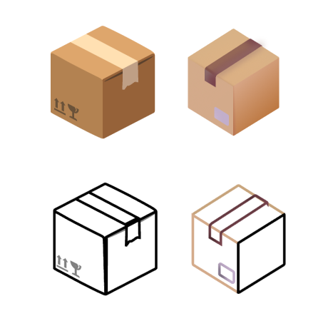
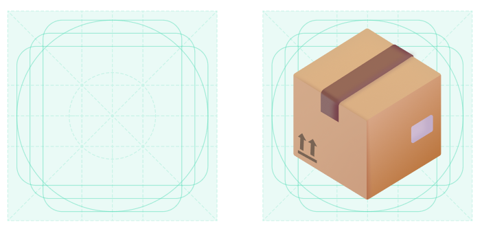
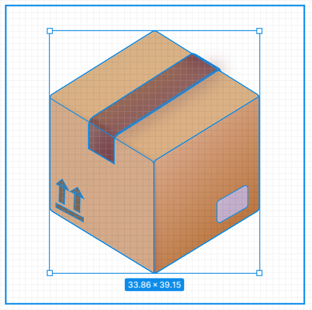
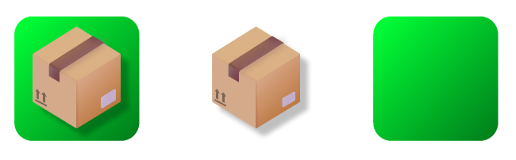
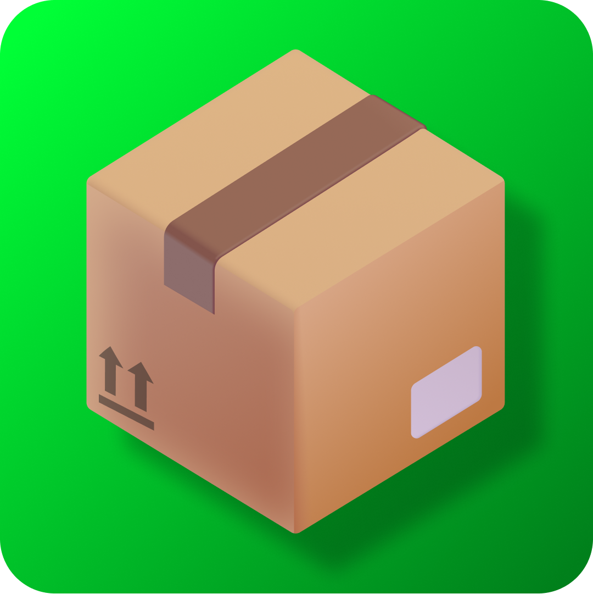

# App Icon Document - InventoryApp

App Icon Documentation Log for InventoryApp

## App Icon Design

The product icon is the icon which identifies the App. For this reason, a product icon has to be simple, colorful, friendly, and directly communicate the purpose of the App. A product icon is a composition of basic shapes, curves, lights and shadows.

The product icon for InventoryApp has to communicate that the App is an inventory management tool, destined either for personal use or for stocktaking in small businesses.

The icon should represent something related to both a container of personal items and a warehouse element. Something able to do both is a package, specifically a closed cardboard box.

The inspirations for the icon, which were also the base from which the icon was built, are open-source icons of cardboard boxes, publicly available.

## App Icon Realization

As the base inspiration icons were already detailed, the Icon realization process was rather straightforward and trivial.

After some small adjustments and personalizations, the icon was "tested" on the Legacy App Icon Guides for Android.

(View of the elementary shapes which compose the icon):

Once the icon foreground was completed, a simple green gradient background was built. After adding shadows, the icon was ready to be assembled and completed.

## App Icon Final

The final result of Design and Realization of the product icon for InventoryApp is the following:

