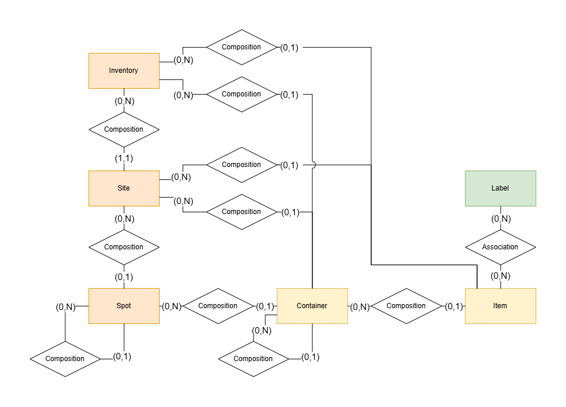

# Design Document - InventoryApp

System Design Document for InventoryApp

Date Completed: 2026-08-17

Date Last Update: 2026-08-17

## UI/UX Design

UI Design choices are not definitive and may be subject to minor changes during the Front-End implementation due to the
differences in the technologies for design and development.

|                    |                                                                                                                                    |
|--------------------|------------------------------------------------------------------------------------------------------------------------------------|
| **Inventory**      |                                                                  |
| **Inventory View** |                                                                              |
| **Item Create**    |                                                                                    |  |
| **Item View**      |                                                             |
| **Label Create**   |                                                                                  | 
| **Label Delete**   |                                                                                  |
| **Label Edit**     |                                                                                      |
| **Search Items**   |                                                       |
| **Search Places**  |   |
| **Account**        |                                                                          |
| **Account Edit**   |                                                                |
| **Statistics**     |                                                           |

## Software Architecture Design

Architectural Pattern: Layered Architecture (Android Variant)
Relational Patterns included: Single Source of Truth (SSOT), Unidirectional Data Flow (UDF)

### Software Components Specification

Main Layers:

|                  |                                       |
|------------------|---------------------------------------|
| **UI Layer**     | Builds and manages the user interface |
| **Domain Layer** | Handles business logic                |
| **Data Layer**   | Obtains and exposes app data          |

Sub-Layers:

|                |                                                                  |
|----------------|------------------------------------------------------------------|
| **Screen**     | Describes the UI and handles user interactions                   |
| **ViewModel**  | Hosts and handles the UI state and manages configuration changes |
| **Repository** | Exposes the app data and centralizes data access                 |
| **DataSource** | Obtain app data and manages persistence                          |

## Software Design

Diagram Type: Semi-Formal Diagram (mix of UML Class and UML Package)

|                |                                                                                                                   |
|----------------|-------------------------------------------------------------------------------------------------------------------|
| **Screen**     |          |
| **ViewModel**  |    |
| **Domain**     |          |
| **Repository** |  |
| **DataSource** |  |

__NOTES:__
- The Domain layer and its use-cases are not strict design specifications, depending on the complexity of the feature
  detected during the development phase, new classes may be added and current ones may be modified or removed.

### Software Sub-Components Specification

| Package / Component    | Description                                                                                                                  |
|------------------------|------------------------------------------------------------------------------------------------------------------------------|
| **MainActivity**       | Functions as the entry point of the App. Necessary in an Android App                                                         |
| **MainApplication**    | Necessary for Dependency Injection                                                                                           |
| **Screen**             | Contains the Compose Screen classes which build the UI and handle UI-specific logic                                          |
| **Theme**              | Contains the Compose Theme classes providing color, typography, and shapes to the App                                        |
| **Navigation**         | Contains the Navigation classes which manage the navigation between Screens                                                  |
| **ViewModel**          | Contains pairs of ViewModel classes and their corresponding State classes                                                    |
| **Domain**             | Contains the UseCase classes which implement the business logic of the App                                                   |
| **Repository**         | Contains groups made of a Repository interface and one or more Repository implementations                                    |
| **RepositoryDIModule** | Is a DI container which provides Repository dependencies to the Domain layer                                                 |
| ***Repository***       | Interface representing the archetype of a Repository                                                                         |
| **DataSourceDIModule** | Is a DI container which provides DataSource dependencies to the Repository layer                                             |
| **Entity**             | Contains the Entity classes which represent the data model of the App and are used by other packages of the DataSource layer |
| **Database**           | Contains the DAO classes which manage the persistence of the App data which is stored in the local database                  |
| **AppDatabase**        | Is the component which manages and represents the local database of the App                                                  |
| **DataStore**          | Contains the DataStore classes which manage the persistence of the App data which is the local filesystem                    |
| **Network**            | Contains the Network classes which manage the persistence of the App data which is stored in a remote server                 |
| **AppNetworkService**  | Is the component which manages and represents the remote server of the App                                                   |

## Database Design

### Conceptual Database Diagram

Diagram Type: Conceptual Entity-Relationship Diagram

### Logical Database Diagram

Diagram Type: UML Entity-Relationship Diagram

## Release Deployment Diagram

More concrete version of the Deployment Diagram, where abstract Artifacts and Components, like external services or
execution environments, are replaced by the ones which are actually going to be implemented in the Release.

Diagram Type: UML Deployment Diagram

