# Design Document - InventoryApp

System Design Document for InventoryApp

Date Completed: --

Date Last Update: 2026-07-21

## UI/UX Design

UI Design choices are not definitive and may be subject to minor changes during the Front-End implementation due to the
differences in the technologies for design and development.

|                    |                                                                                                                                    |
|--------------------|------------------------------------------------------------------------------------------------------------------------------------|
| **Inventory**      | 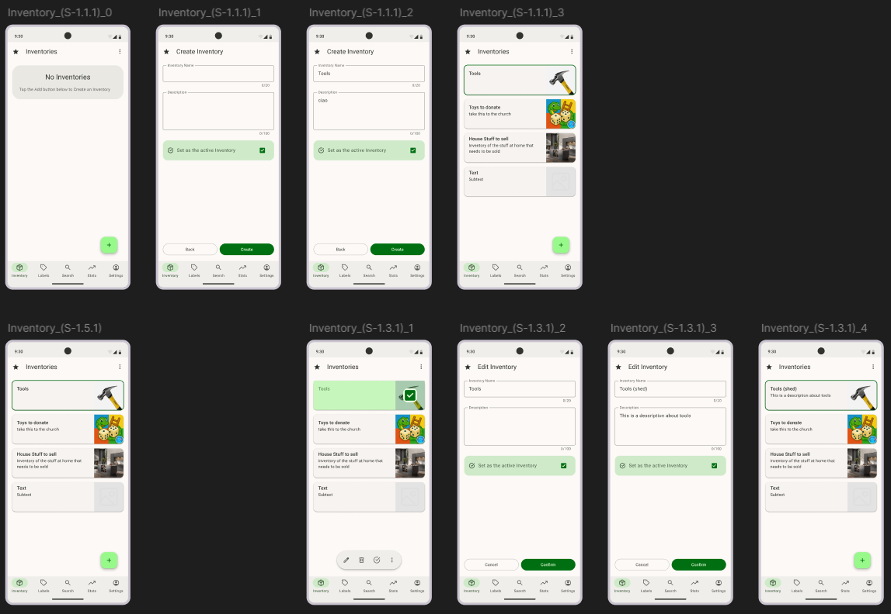                                                                 |
| **Inventory View** | 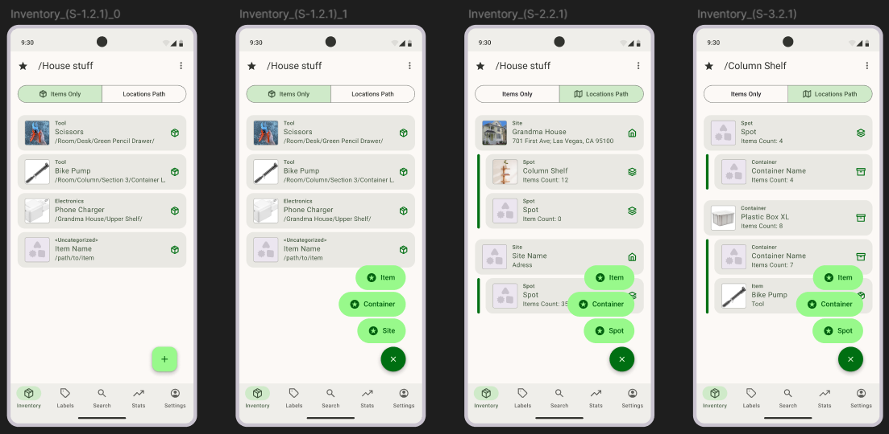                                                                             |
| **Item Create**    | 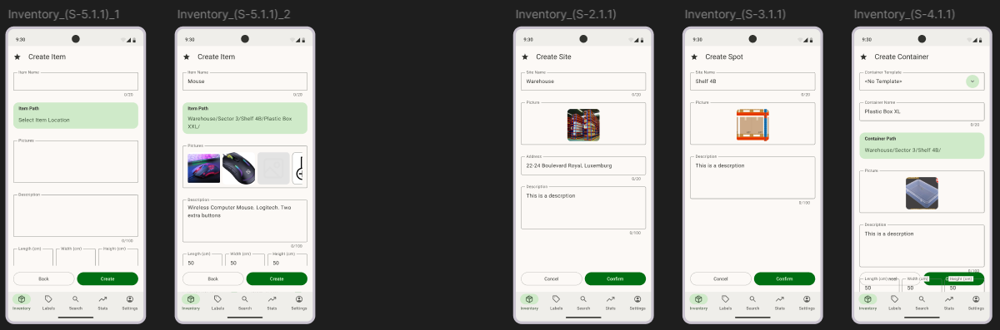                                                                                   |  |
| **Item View**      | 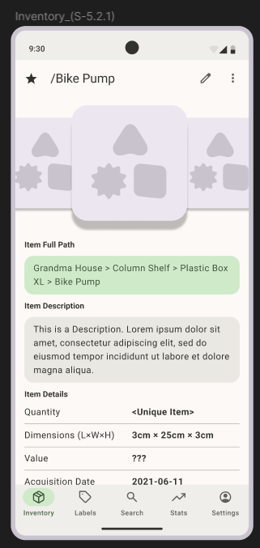                                                            |
| **Label Create**   | 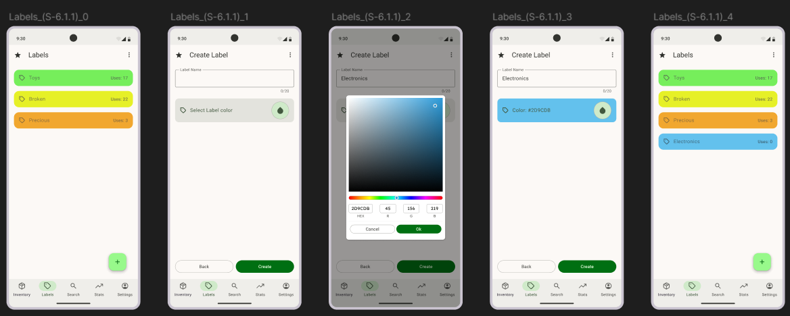                                                                                 | 
| **Label Delete**   | 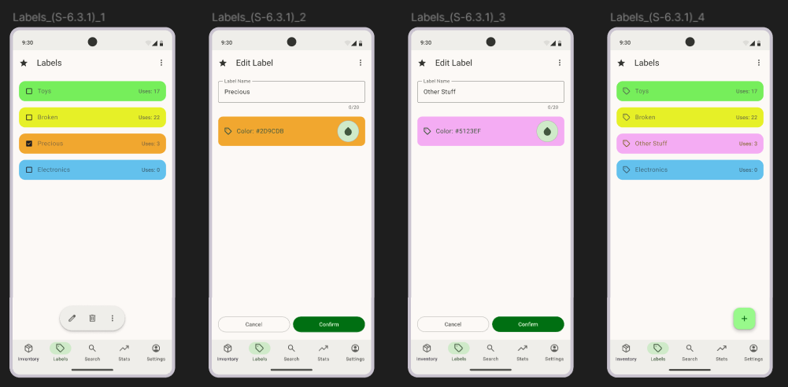                                                                                 |
| **Label Edit**     | 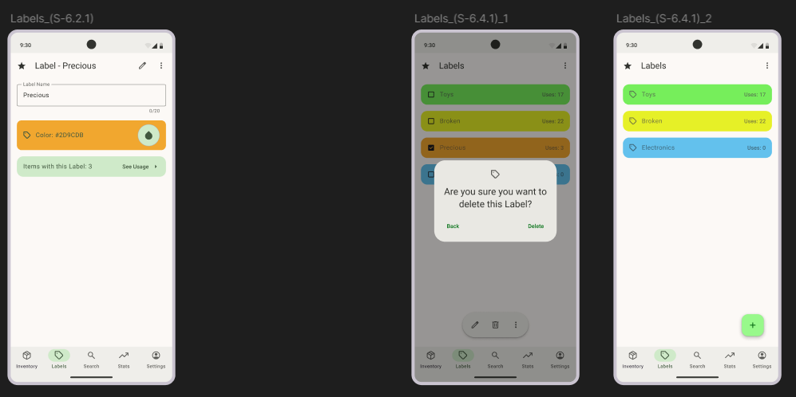                                                                                     |
| **Search Items**   | 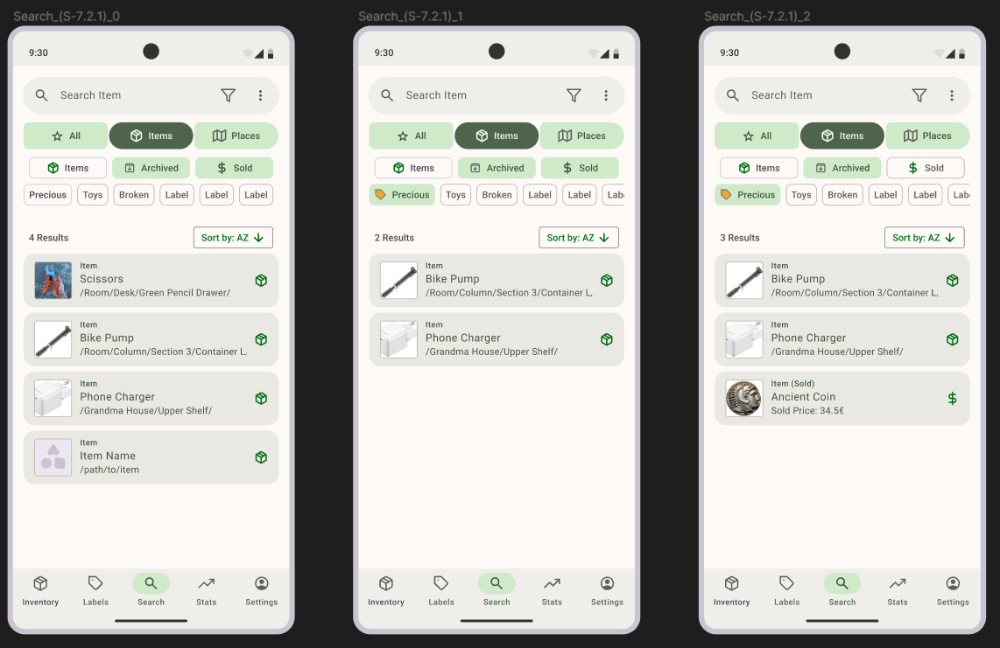                                                      |
| **Search Places**  | 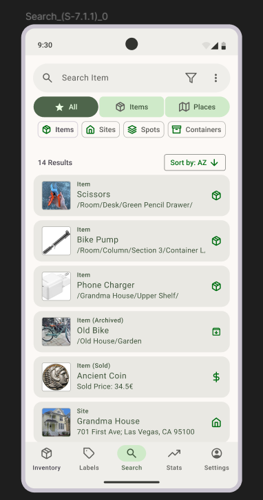 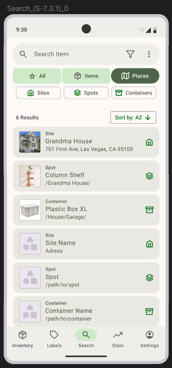 |
| **Account**        | 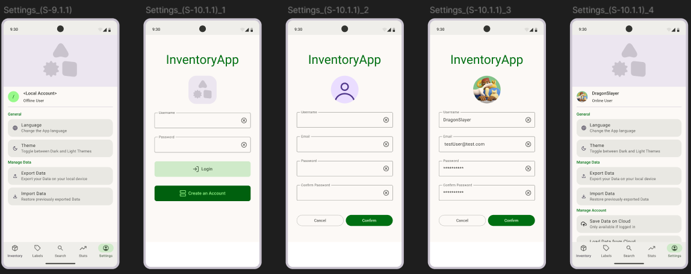                                                                         |
| **Account Edit**   | 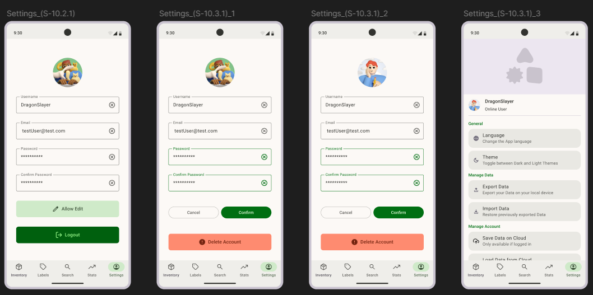                                                               |
| **Statistics**     | 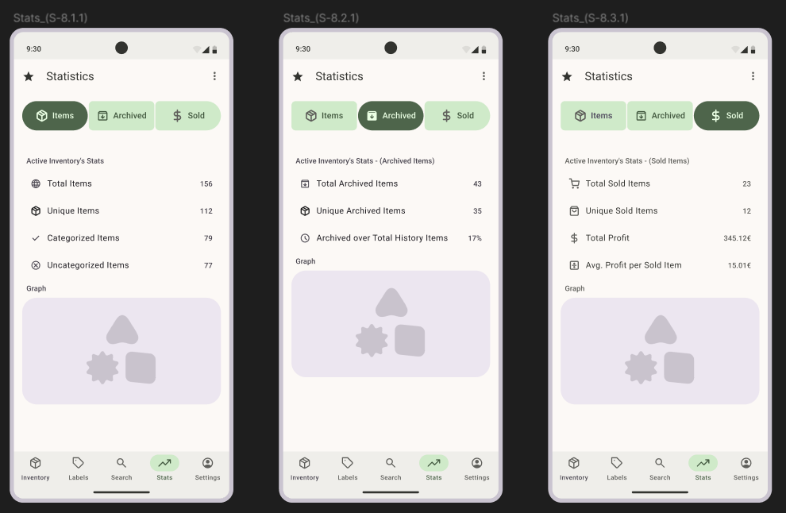                                                          |

## Software Architecture Design

Architectural Pattern: Layered Architecture (Android Variant)
Relational Patterns included: Single Source of Truth (SSOT), Unidirectional Data Flow (UDF)

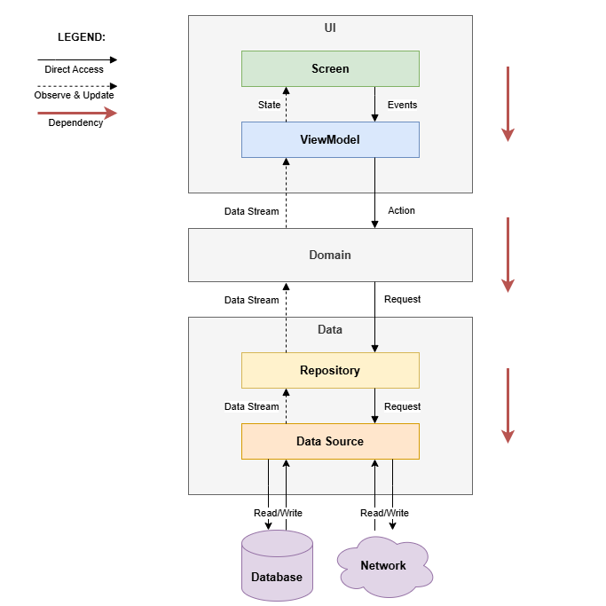

### Software Components Specification

Main Layers:

|                  |                                       |
|------------------|---------------------------------------|
| **UI Layer**     | Builds and manages the user interface |
| **Domain Layer** | Handles business logic                |
| **Data Layer**   | Obtains and exposes app data          |

Sub-Layers:

|                |                                                                  |
|----------------|------------------------------------------------------------------|
| **Screen**     | Describes the UI and handles user interactions                   |
| **ViewModel**  | Hosts and handles the UI state and manages configuration changes |
| **Repository** | Exposes the app data and centralizes data access                 |
| **DataSource** | Obtain app data and manages persistence                          |

## Software Design

Diagram Type: Semi-Formal Diagram (mix of UML Class and UML Package)

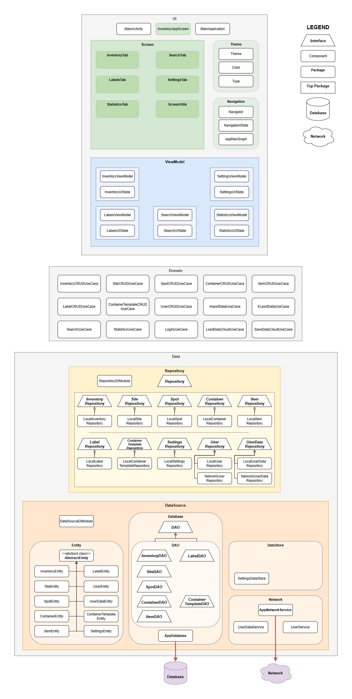

|                |                                                                                                                   |
|----------------|-------------------------------------------------------------------------------------------------------------------|
| **Screen**     | 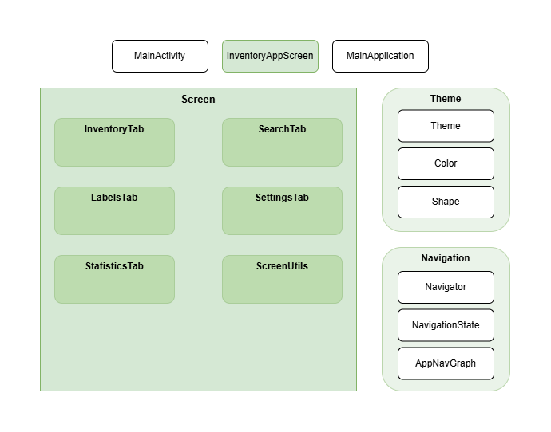         |
| **ViewModel**  | 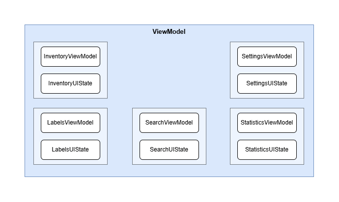   |
| **Domain**     | 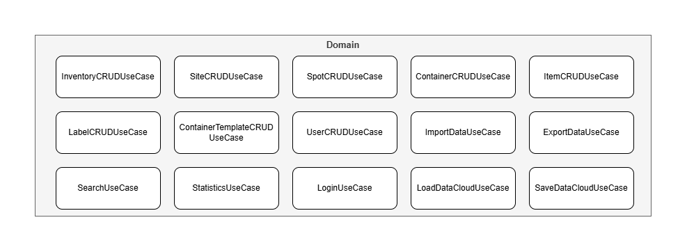         |
| **Repository** | 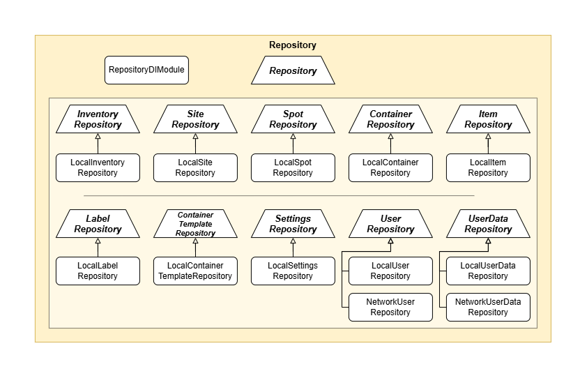 |
| **DataSource** | 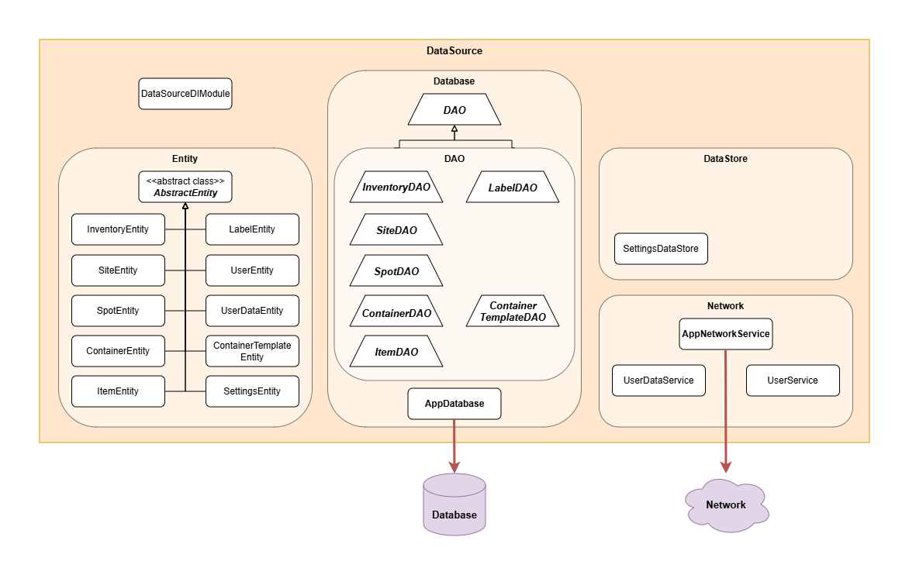 |

__NOTES:__
- The Domain layer and its use-cases are not strict design specifications, depending on the complexity of the feature detected during the development phase, new classes may be added and current ones may be modified or removed.

### Software Modules Specification

## Database Design

## Release Deployment Diagram

More concrete version of the Deployment Diagram, where abstract Artifacts and Components, like external services or
execution environments, are replaced by the ones which are actually going to be implemented in the Release.
