# Project Estimation

Project Estimation for InventoryApp

Date Completed: 2026-07-21

Date Last Update: 2026-07-21

### Estimation approach

Estimates should not be considered particularly accurate as it is a 1-person-project with no fixed work schedule.

__Measuring Units Legend__:

- ph = Person Hours (1 ph = 1 person working 1 hour)
- pd = Person Days (1 pd = 8 ph)
- pw = Person Weeks (1 pw = 7 pd = 56 ph) (in this particular case)
- LOC = Lines of Code
- Euro (€) = Euro currency
- Calendar Time = [w = week, d = day, h = hour]

## Estimate by Size

__Legend__:

- Estimated Number of Classes (NC) => Classes to be developed
- Estimated Average Size per Class (A) => Average size of a class, in LOC
- Estimated Size of Project (S) => $NC * A$
- Estimated Effort (E) => $S / (15 \frac{LOC}{h})$ (Pessimistic estimate of 15 LOC/h)
- Estimated Cost (C) => $E * 0€$ (Is a personal project)
- __Estimated Total Time (Effort)__ (Tot) $E / (TeamSize * 8 \frac{h}{day} * 7 \frac{days}{week})$ (Working 7 days a
  week)
- __Estimated Calendar Time__ => $Tot / TeamSize$ (In this case, TeamSize = 1)

| Metric                            | Estimate     |
|:----------------------------------|:-------------|
| Estimated Number of Classes       | 75           |
| Estimated Average Size per Class  | 60           |
| Estimated Size of Project         | 4500         |
| Estimated Effort                  | 300          |
| Estimated Cost                    | 0€           |
| __Estimated Total Time (Effort)__ | __300ph__    |
| __Estimated Calendar Time__       | __5w 2d 4h__ |

__Notes__:

- Assuming "Class" as the Java concept of "class", that is, a "module". If this was not the case, the NC estimate would
  be less informative as it would not include all system modules that are not classes.
- The Number of Classes is roughly estimated starting from the number of "Entities" in the project and then multiplying
  by the number of modules that will be created for each of the (ex: Repository, Model, View, DAO, etc.). On the top of
  that, the number of support modules (ex: Utils, Error, etc.) is added.
- Estimated Average Size per Class is estimated considering that the most modules are small (ex: DAO, Repository, etc.).

## Estimate by Product Decomposition

| Component Name        | Estimated Effort (ph) |
|-----------------------|-----------------------|
| Requirements Document | 25                    |
| Design Document       | 20                    |
| Code                  | 200                   |
| Informal Testing Docs | 5                     |
| Management Documents  | 10                    |
| __Total__             | __260__               |

__Notes__:

- "Management Documents" are those documents in charge of managing the project (Timesheet, Estimation, etc.) plus the
  time spent on ALM and VC tools.

## Estimate by Activity Decomposition

__Sections Legend__:

- Planning: Concept Phase, Requirement Engineering
- Design: System Architecture Design, UI & UX Design, Database Design, System Design
- Development: Development Back-end - Entities, Development Back-end - Logic, Development Front-end
- Testing: Informal Testing
- Release: System/App Documentation

| Activity Name                   | Estimated Effort (ph) |
|:--------------------------------|:----------------------|
| Concept Phase                   | 15                    |
| Requirement Engineering         | 25                    |
| Software Architecture Design    | 4                     |
| UI & UX Design                  | 8                     |
| Database Design                 | 2                     |
| Software Design                 | 10                    |
| Development Back-end - Entities | 75                    |
| Development Back-end - Logic    | 75                    |
| Development Front-end           | 50                    |
| Informal Testing                | 5                     |
| System/App Documentation        | 5                     |
| __Total__                       | __275__               |

__Notes__:

- Being an Android Project, in the GANTT Chart the Development of Back-end and Front-end are considered to be doable in
  parallel, as the Back-end modules cannot exist or properly work without at least part of the Front-end being present.

### GANTT Chart

```mermaid

gantt
    title GANTT Chart (1d = 8ph; mon-sun)
    dateFormat X
    todayMarker off
    tickinterval 1week
	weekday monday
	axisFormat Day %d


	section Planning
		Concept Phase 						:a1, 0, 1.875d
		Requirement Engineering 			:a2, after a1, 3.125d

	section Design
		Software Architecture Design 		:b1, after a2, 0.5d
		UI & UX Design 						:b2, after b1, 1.0d
		Database Design 					:b3, after b2, 0.25d
		Software Design 					:b4, after b3, 1.25d

	section Development
		Development Back-end - Entities 	:c1, after b4, 9.375d
		Development Back-end - Logic 		:c2, after c1, 9.375d
		Development Front-end 				:c3, after b4, 6.25d

	section Testing
		Informal Testing 					:d1, after c2, 0.625d

	section Release
		System/App Documentation 			:e1, after d1, 0.625d

```

## Summary

| Estimate Type                      | Estimated Effort | Estimated Duration |
|------------------------------------|------------------|--------------------|
| Estimate by Size                   | 300ph            | 5w 2d 4h           |
| Estimate by Product Decomposition  | 260ph            | 4w 5d 4h           |
| Estimate by Activity Decomposition | 275ph            | 4w 6d 3h           |
| __Avg Estimated Effort__           | __278.3ph__      | __5w__             |

