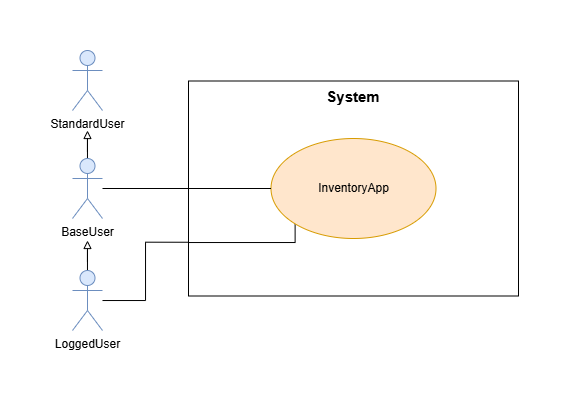
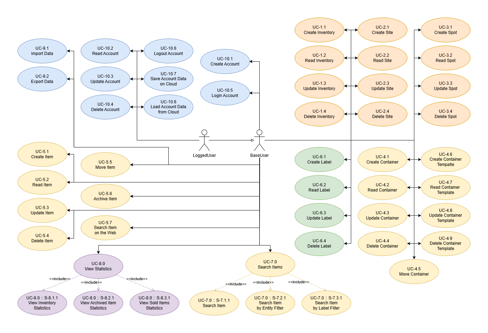

# Requirements Document - InventoryApp

Date: 2026-07-18

Version: v1 - Requirements Analysis for InventoryApp

| Version | Curr App Version | Curr Milestone | Change |
|:-------:|:-----------------|:---------------|:-------|
|   v1    | v0.1.0-alpha     | Requirements   | -      |

#### Contents

- [Requirements Document - InventoryApp](#requirements-document---inventoryapp)
	* [Informal Description](#informal-description)
	* [Business Model](#business-model)
	* [Stakeholders](#stakeholders)
	* [Requirements Elicitation](#requirements-elicitation)
		+ [Personas](#personas)
		+ [Problems](#problems)
		+ [Needs (User Stories)](#needs-user-stories)
	* [Context](#context)
		+ [Actors](#actors)
		+ [Context Diagram](#context-diagram)
		+ [System Interaction Interfaces](#system-interaction-interfaces)
	* [Requirements](#requirements)
		+ [Functional Requirements](#functional-requirements)
			- [Table of Rights](#table-of-rights)
		+ [Non-Functional Requirements](#non-functional-requirements)
	* [Use Cases Diagram](#use-cases-diagram)
	* [Use Cases](#use-cases)
		+ [Use Case 1.1 (UC-1.1): Create Inventory](#use-case-11-uc-11-create-inventory)
		+ [Use Case 1.2 (UC-1.2): Read Inventory](#use-case-12-uc-12-read-inventory)
		+ [Use Case 1.3 (UC-1.3): Update Inventory](#use-case-13-uc-13-update-inventory)
		+ [Use Case 1.4 (UC-1.4): Delete Inventory](#use-case-14-uc-14-delete-inventory)
		+ [Use Case 1.5 (UC-1.5): Read Inventory List](#use-case-15-uc-15-read-inventory-list)
		+ [Use Case 1.6 (UC-1.6): Switch Inventory](#use-case-16-uc-16-switch-inventory)
		+ [Use Case 2.1 (UC-2.1): Create Site](#use-case-21-uc-21-create-site)
		+ [Use Case 2.2 (UC-2.2): Read Site](#use-case-22-uc-22-read-site)
		+ [Use Case 2.3 (UC-2.3): Update Site](#use-case-23-uc-23-update-site)
		+ [Use Case 2.4 (UC-2.4): Delete Site](#use-case-24-uc-24-delete-site)
		+ [Use Case 3.1 (UC-3.1): Create Spot](#use-case-31-uc-31-create-spot)
		+ [Use Case 3.2 (UC-3.2): Read Spot](#use-case-32-uc-32-read-spot)
		+ [Use Case 3.3 (UC-3.3): Update Spot](#use-case-33-uc-33-update-spot)
		+ [Use Case 3.4 (UC-3.4): Delete Spot](#use-case-34-uc-34-delete-spot)
		+ [Use Case 4.1 (UC-4.1): Create Container](#use-case-41-uc-41-create-container)
		+ [Use Case 4.2 (UC-4.2): Read Container](#use-case-42-uc-42-read-container)
		+ [Use Case 4.3 (UC-4.3): Update Container](#use-case-43-uc-43-update-container)
		+ [Use Case 4.4 (UC-4.4): Delete Container](#use-case-44-uc-44-delete-container)
		+ [Use Case 4.5 (UC-4.5): Move Container](#use-case-45-uc-45-move-container)
		+ [Use Case 4.6 (UC-4.6): Create Container Template](#use-case-46-uc-46-create-container-template)
		+ [Use Case 4.7 (UC-4.7): Read Container Template](#use-case-47-uc-47-read-container-template)
		+ [Use Case 4.8 (UC-4.8): Update Container Template](#use-case-48-uc-48-update-container-template)
		+ [Use Case 4.9 (UC-4.9): Delete Container Template](#use-case-49-uc-49-delete-container-template)
		+ [Use Case 5.1 (UC-5.1): Create Item](#use-case-51-uc-51-create-item)
		+ [Use Case 5.2 (UC-5.2): Read Item](#use-case-52-uc-52-read-item)
		+ [Use Case 5.3 (UC-5.3): Update Item](#use-case-53-uc-53-update-item)
		+ [Use Case 5.4 (UC-5.4): Delete Item](#use-case-54-uc-54-delete-item)
		+ [Use Case 5.5 (UC-5.5): Move Item](#use-case-55-uc-55-move-item)
		+ [Use Case 5.6 (UC-5.6): Archive Item](#use-case-56-uc-56-archive-item)
		+ [Use Case 5.7 (UC-5.7): Search Item on Web](#use-case-57-uc-57-search-item-on-web)
		+ [Use Case 6.1 (UC-6.1): Create Label](#use-case-61-uc-61-create-label)
		+ [Use Case 6.2 (UC-6.2): Read Label](#use-case-62-uc-62-read-label)
		+ [Use Case 6.3 (UC-6.3): Update Label](#use-case-63-uc-63-update-label)
		+ [Use Case 6.4 (UC-6.4): Delete Label](#use-case-64-uc-64-delete-label)
		+ [Use Case 7.0 (UC-7.0): Search Items](#use-case-70-uc-70-search-items)
		+ [Use Case 8.0 (UC-8.0): View Statistics](#use-case-80-uc-80-view-statistics)
		+ [Use Case 9.1 (UC-9.1): Export Data](#use-case-91-uc-91-export-data)
		+ [Use Case 9.2 (UC-9.2): Import Data](#use-case-92-uc-92-import-data)
		+ [Use Case 10.1 (UC-10.1): Create Account](#use-case-101-uc-101-create-account)
		+ [Use Case 10.2 (UC-10.2): Read Account](#use-case-102-uc-102-read-account)
		+ [Use Case 10.3 (UC-10.3): Update Account](#use-case-103-uc-103-update-account)
		+ [Use Case 10.4 (UC-10.4): Delete Account](#use-case-104-uc-104-delete-account)
		+ [Use Case 10.5 (UC-10.5): Login Account](#use-case-105-uc-105-login-account)
		+ [Use Case 10.6 (UC-10.6): Logout Account](#use-case-106-uc-106-logout-account)
		+ [Use Case 10.7 (UC-10.7): Save Account Data on Cloud](#use-case-107-uc-107-save-account-data-on-cloud)
		+ [Use Case 10.8 (UC-10.8): Load Account Data from Cloud](#use-case-108-uc-108-load-account-data-from-cloud)
	* [System Design Diagram](#system-design-diagram)
	* [Deployment Diagram](#deployment-diagram)
	* [Glossary](#glossary)
		+ [Glossary Terms](#glossary-terms)
		+ [Glossary Diagram](#glossary-diagram)

## Informal Description

InventoryApp is a stock management (inventory, stock, stocktaking) Android application which keeps track of the location
of items and provides multiple features to help find, organize and visualize items.

## Business Model

There are multiple possible business models for InventoryApp.

__Open Source__: InventoryApp could be released as an open-source project, publicly available and free to use and
modify. With this model financial support could come from donations, enterprise licensing, paid technical support,
hosting.

__Proprietary Software__: InventoryApp could be released as a standard proprietary software, obtainable through a
one-time purchase.

__Software as a Service (SaaS)__: InventoryApp could be released as a subscription-based service, with a monthly or
yearly fee to use the app.

__Freemium__: InventoryApp could be released as a free app with basic features, and lock the full functionality behind a
paywall, with a one-time purchase or a subscription model.

__Adware__: InventoryApp could be released as a free app with and display ads to the user, with the possibility of
removing ads through payment, combining with other business models.

__Commissioning__: InventoryApp could be proposed to a particular client while in early development, and be commissioned
to be developed ad-hoc for that specific client.

## Stakeholders

| Stakeholder         | Description                                                                                                                                                |
|:--------------------|:-----------------------------------------------------------------------------------------------------------------------------------------------------------|
| User (Generic)      | Private citizen who wishes to catalogate their personal proprieties to whatever purpose (selling, separation of propriety, stocktaking, house moving)      |
| Small Businesses    | Owners of small commercial activities, like stores, who need a digitalized solution to manage their inventory and catalogate their goods                   |
| Private Companies   | Companies with a Logistic Division, or in general with logistic necessities who needs a pocket solution usable by any worker at any time in the warehouses |
| Compulsive Hoarders | Individuals who collect large quantities of unrelated items and need a way to categorize and track them                                                    |
| Collectors          | Individuals who collect items of interest and need a way to organize their collections either for tidiness or for future selling                           |
| Payment Service     | (If the App requires payment processing) The payment service for the purchase of the App license                                                           |

## Requirements Elicitation

Information collected informally during the Concept phase of the project. In this section such intel is organized and
partially formalized so that it can be used in the rest of the Requirements Engineering process.

### Personas

__Persona 1 - "Nonno"__:
Man, Old, 93, Retired

He owns an assorted collection of objects, large and small, tools and utensils, furniture and machinery, basically
everything. He needs a fast way to track and catalog his items.

__Persona 2 - "Filippo"__:
Man, Young, 24, Student

He has recently found his old collection of toys, soon he will have to move to a new apartment. He needs a way to
catalog his items distinguishing between personal items, toys, clothes, etc.

__Persona 3 - "Maria"__:
Woman, Adult, 56, Professor

She has a large collection of books, and she needs a way to catalog them and keep track of their location in her house.

__Persona 4 - "Miriam"__:
Woman, Adult, 40, Housewife

She owns a large amount of clothes from her family, both old and currently in use. She wants to free the house from old
stuff and an easy way to track and catalog clothes and other junk to be sold or donated.

__Persona 5 - "John"__:
Man, Adult, 35, Warehouse Worker

He works in a warehouse and his tired to be handled a printed list of items to be stocked and moved. He would prefer a
smarter solution.

### Problems

| Problem                 | Description                                                                                                 |
|:------------------------|:------------------------------------------------------------------------------------------------------------|
| Large amount of Items   | Some people own large amounts of assorted items                                                             |
| Cannot find belongings  | People often forget where they put their things                                                             |
| Unorganized Items       | Items are often stored without a precise orden an without any form of labeling                              |
| Paper notes Stocktaking | Inventories written on pieces of paper can easily be lost or forgotten                                      |
| Stocktaking is Boring   | Many people do not like writing inventories, mainly because is a slow process                               |
| Decentralized Inventory | Both in personal and professional settings an Inventory is tied to a location and has a single access point |
| Lack of Info on Items   | Most existing stocktaking systems for small and medium stores only store the item name                      |

### Needs (User Stories)

User Stories are the translation of the Problems into Needs, they are still written informally and without using
technical language, therefore they still cannot and should not be considered Requisites.

| User Story                        | User Story Description                                                    |
|:----------------------------------|:--------------------------------------------------------------------------|
| US1 - Store Item                  | __As a__ User                                                             |                
|                                   | __I want to__ memorize an Item                                            |              
|                                   | __So that__ I can track its existence                                     |
| --------------------------        | -------------------------------------------------                         |
| US2 - Store Item Location         | __As a__ User                                                             |                
|                                   | __I want to__ memorize the main info of an Item (location, name, desc)    |              
|                                   | __So that__ I can find it                                                 |
| --------------------------        | -------------------------------------------------                         |
| US3 - Store Item Details          | __As a__ User                                                             |                
|                                   | __I want to__ memorize additional details of an Item                      |              
|                                   | __So that__ I can remeber and visualize such info later                   |
| --------------------------        | -------------------------------------------------                         |
| US4 - Store Item Pictures         | __As a__ User                                                             |                
|                                   | __I want to__ memorize one or more pictures of the item                   |              
|                                   | __So that__ I can see the Item                                            |
| --------------------------        | -------------------------------------------------                         |
| US5 - Search Item                 | __As a__ User                                                             |                
|                                   | __I want to__ search an Item                                              |              
|                                   | __So that__ I can visualize it                                            |
| --------------------------        | -------------------------------------------------                         |
| US6 - Visualize Item              | __As a__ User                                                             |                
|                                   | __I want to__ visualize all the info about on Item                        |              
|                                   | __So that__ I can see its details                                         |
| --------------------------        | -------------------------------------------------                         |
| US7 - Apply Labels                | __As a__ User                                                             |                
|                                   | __I want to__ apply one or more labels to an Item                         |              
|                                   | __So that__ I can better categorize them                                  |
| --------------------------        | -------------------------------------------------                         |
| US8 - Create new Labels           | __As a__ User                                                             |                
|                                   | __I want to__ create new Labels                                           |              
|                                   | __So that__ I can use my own categoris on items                           |
| --------------------------        | -------------------------------------------------                         |
| US9 - Visualize Items by Location | __As a__ User                                                             |                
|                                   | __I want to__ visualize a list of all the Items in a specific Location    |              
|                                   | __So that__ I can know what Items a certain Location contains             |
| --------------------------        | -------------------------------------------------                         |
| US10 - Visualize Items by Labels  | __As a__ User                                                             |                
|                                   | __I want to__ visualize a list of all the Items with specific Labels      |              
|                                   | __So that__ I can the see the Items for each category                     |
| --------------------------        | -------------------------------------------------                         |
| US11 - Create Inventory           | __As a__ User                                                             |                
|                                   | __I want to__ create new "Inventories"                                    |              
|                                   | __So that__ I can have multiple "Inventories"                             |
| --------------------------        | -------------------------------------------------                         |
| US12 - Switch Inventory           | __As a__ User                                                             |                
|                                   | __I want to__ switch between "Inventories"                                |              
|                                   | __So that__ I can operate on a different Inventory                        |
| --------------------------        | -------------------------------------------------                         |
| US13 - Update Item                | __As a__ User                                                             |                
|                                   | __I want to__ modify the details of an existing Item                      |              
|                                   | __So that__ I can update the Item details                                 |
| --------------------------        | -------------------------------------------------                         |
| US14 - Delete Item                | __As a__ User                                                             |                
|                                   | __I want to__ delete an Item from the Inventory                           |              
|                                   | __So that__ I can stop tracking the Item                                  |
| --------------------------        | -------------------------------------------------                         |
| US15 - Archive Item               | __As a__ User                                                             |                
|                                   | __I want to__ archive an Item without deleting it                         |              
|                                   | __So that__ I can keep a memento of an old or sold Item                   |
| --------------------------        | -------------------------------------------------                         |
| US16 - Save Data Remotely         | __As a__ User                                                             |                
|                                   | __I want to__ save the Inventories data remotely                          |              
|                                   | __So that__ I can access data from other devices                          |
| --------------------------        | -------------------------------------------------                         |
| US17 - Export Data                | __As a__ User                                                             |                
|                                   | __I want to__ export the Inventory data                                   |              
|                                   | __So that__ I can backup it or share it                                   |
| --------------------------        | -------------------------------------------------                         |
| US18 - Import Data                | __As a__ User                                                             |                
|                                   | __I want to__ import the Inventory data                                   |              
|                                   | __So that__ I can import a backup or data shared to me                    |
| --------------------------        | -------------------------------------------------                         |
| US19 - Visualize Statistics       | __As a__ User                                                             |                
|                                   | __I want to__ visualize some statistics about an Inventory                |              
|                                   | __So that__ I can see global information about the Inventory              |
| --------------------------        | -------------------------------------------------                         |
| US20 - Search Item on the Web     | __As a__ User                                                             |                
|                                   | __I want to__ search one of my items, either by name or image, on the web |              
|                                   | __So that__ I can get additional info on it for knowledge or selling      |
| --------------------------        | -------------------------------------------------                         |

## Context

### Actors

From Problems and Needs, no particular differences between types of users can be identified. Basically there is only a "
StandardUser". In general, every StandardUser access the same functionalities, with the same privileges, and with the
same interfaces; the only small difference is that LoggedUsers have some exclusive functionalities.

| Actor Name | Description                                             |
|:-----------|:--------------------------------------------------------|
| BaseUser   | Anyone who uses the App (not logged in)                 |
| LoggedUser | Anyone who uses the App (with an Account and logged in) |

### Context Diagram

In the case of a system with a single type of Actor, the Context Diagram is trivial as there is only one type of
external entity which interacts with the system.

### System Interaction Interfaces

| Actor      | Logical Interface | Physical Interface |
|:-----------|:-----------------:|:------------------:|
| BaseUser   |        GUI        |     Smartphone     |
| LoggedUser |        GUI        |     Smartphone     |

## Requirements

### Functional Requirements

| ID        | Description                    |
|:----------|:-------------------------------|
| __FR-1__  | __Manage Inventory__           |
| FR-1.1    | Create Inventory               |
| FR-1.2    | Read Invetory                  |
| FR-1.3    | Update Invetory                |
| FR-1.4    | Delete Invetory                |
| FR-1.5    | Read Invetory List             |
| FR-1.6    | Switch Invetory                |
| __FR-2__  | __Manage Site__                |
| FR-2.1    | Create Site                    |
| FR-2.2    | Read Site                      |
| FR-2.3    | Update Site                    |
| FR-2.4    | Delete Site                    |
| __FR-3__  | __Manage Spot__                |
| FR-3.1    | Create Spot                    |
| FR-3.2    | Read Spot                      |
| FR-3.3    | Update Spot                    |
| FR-3.4    | Delete Spot                    |
| __FR-4__  | __Manage Container__           |
| FR-4.1    | Create Container               |
| FR-4.2    | Read Container                 |
| FR-4.3    | Update Container               |
| FR-4.4    | Delete Container               |
| FR-4.5    | Move Container                 |
| FR-4.6    | Create Container Template      |
| FR-4.7    | Read Container Template        |
| FR-4.8    | Update Container Template      |
| FR-4.9    | Delete Container Template      |
| __FR-5__  | __Manage Item__                |
| FR-5.1    | Create Item                    |
| FR-5.2    | Read Item                      |
| FR-5.3    | Update Item                    |
| FR-5.4    | Delete Item                    |
| FR-5.5    | Move Item                      |
| FR-5.6    | Archive Item                   |
| FR-5.7    | Search Item on Web             |
| __FR-6__  | __Manage Label__               |
| FR-6.1    | Create Label                   |
| FR-6.2    | Read Label                     |
| FR-6.3    | Update Label                   |
| FR-6.4    | Delete Label                   |
| __FR-7__  | __Search Item__                |
| FR-7.1    | Search Item                    |
| FR-7.2    | Search by Entity Filter        |
| FR-7.3    | Search Item by Label Filter    |
| __FR-8__  | __View Statistics__            |
| FR-8.1    | View Inventory Statistics      |
| FR-8.2    | View Archived Items Statistics |
| FR-8.3    | View Sold Items Statistics     |
| __FR-9__  | __Manage Data__                |
| FR-9.1    | Export Data                    |
| FR-9.2    | Import Data                    |
| __FR-10__ | __Manage Account__             |
| FR-10.1   | Create Account                 |
| FR-10.2   | Read Account                   |
| FR-10.3   | Update Account                 |
| FR-10.4   | Delete Account                 |
| FR-10.5   | Login Account                  |
| FR-10.6   | Logout Account                 |
| FR-10.7   | Save Account Data on Cloud     |
| FR-10.8   | Load Account Data from Cloud   |

### Non-Functional Requirements

The possible types of Non-Functional Requirement are the following: Correctness, Usability, Efficiency, Reliability,
Maintainability, Portability, Security, Safety, Interoperability, Ethical, Standard, Privacy, Domain.

|  ID   | Type      | Description                           | Refers to |
|:-----:|:----------|:--------------------------------------|:---------:|
| NFR-1 | Domain    | The App must support Italian language |     -     |
| NFR-2 | Usability | The App must have a Dark Mode         |     -     |

#### Table of Rights

In the case of a system with a single type of Actor, the Table of Rights is trivial.

|   FR    |      BaseUser      |     LoggedUser     |
|:-------:|:------------------:|:------------------:|
| FR-1.1  | :white_check_mark: | :white_check_mark: |
| FR-1.2  | :white_check_mark: | :white_check_mark: |
| FR-1.3  | :white_check_mark: | :white_check_mark: |
| FR-1.4  | :white_check_mark: | :white_check_mark: |
| FR-1.5  | :white_check_mark: | :white_check_mark: |
| FR-1.6  | :white_check_mark: | :white_check_mark: |
| FR-2.1  | :white_check_mark: | :white_check_mark: |
| FR-2.2  | :white_check_mark: | :white_check_mark: |
| FR-2.3  | :white_check_mark: | :white_check_mark: |
| FR-2.4  | :white_check_mark: | :white_check_mark: |
| FR-3.1  | :white_check_mark: | :white_check_mark: |
| FR-3.2  | :white_check_mark: | :white_check_mark: |
| FR-3.3  | :white_check_mark: | :white_check_mark: |
| FR-3.4  | :white_check_mark: | :white_check_mark: |
| FR-4.1  | :white_check_mark: | :white_check_mark: |
| FR-4.2  | :white_check_mark: | :white_check_mark: |
| FR-4.3  | :white_check_mark: | :white_check_mark: |
| FR-4.4  | :white_check_mark: | :white_check_mark: |
| FR-4.5  | :white_check_mark: | :white_check_mark: |
| FR-4.6  | :white_check_mark: | :white_check_mark: |
| FR-4.7  | :white_check_mark: | :white_check_mark: |
| FR-4.8  | :white_check_mark: | :white_check_mark: |
| FR-4.9  | :white_check_mark: | :white_check_mark: |
| FR-5.1  | :white_check_mark: | :white_check_mark: |
| FR-5.2  | :white_check_mark: | :white_check_mark: |
| FR-5.3  | :white_check_mark: | :white_check_mark: |
| FR-5.4  | :white_check_mark: | :white_check_mark: |
| FR-5.5  | :white_check_mark: | :white_check_mark: |
| FR-5.6  | :white_check_mark: | :white_check_mark: |
| FR-5.7  | :white_check_mark: | :white_check_mark: |
| FR-6.1  | :white_check_mark: | :white_check_mark: |
| FR-6.2  | :white_check_mark: | :white_check_mark: |
| FR-6.3  | :white_check_mark: | :white_check_mark: |
| FR-6.4  | :white_check_mark: | :white_check_mark: |
| FR-7.1  | :white_check_mark: | :white_check_mark: |
| FR-7.2  | :white_check_mark: | :white_check_mark: |
| FR-7.3  | :white_check_mark: | :white_check_mark: |
| FR-8.1  | :white_check_mark: | :white_check_mark: |
| FR-8.2  | :white_check_mark: | :white_check_mark: |
| FR-8.3  | :white_check_mark: | :white_check_mark: |
| FR-9.1  | :white_check_mark: | :white_check_mark: |
| FR-9.2  | :white_check_mark: | :white_check_mark: |
| FR-10.1 | :white_check_mark: | :white_check_mark: |
| FR-10.2 |        :x:         | :white_check_mark: |
| FR-10.3 |        :x:         | :white_check_mark: |
| FR-10.4 |        :x:         | :white_check_mark: |
| FR-10.5 | :white_check_mark: | :white_check_mark: |
| FR-10.6 |        :x:         | :white_check_mark: |
| FR-10.7 |        :x:         | :white_check_mark: |
| FR-10.8 |        :x:         | :white_check_mark: |

## Use Cases Diagram

## Use Cases

| UC-1 - S1.1                           | Scenario 1.1: Use Case Name (Scenario Spec) |
|:--------------------------------------|:--------------------------------------------|
| Pre-condition                         |                                             |
| Post-condition                        |                                             |
| 
 __Step#__ 
 | 
 __Description__ 
 |
| 
 1 
         |                                             |
| 
 2 
         |                                             |
| 
 3 
         |                                             |
| 
 4 
         |                                             |

### Use Case 1.1 (UC-1.1): Create Inventory

| UC-1.1           | Use Case 1.1: Create Inventory | 
|:-----------------|:-------------------------------|
| Actors Involved  | BaseUser                       |
| Pre-condition    | //                             |
| Post-condition   | Inventory is created           |
| Nominal Scenario | Scenario 1.1.1                 |
| Variants         | //                             |
| Exceptions       | Scenario 1.1.2, Scenario 1.1.3 |

#### Scenario 1.1.1: Create Inventory (Successful)

| UC-1.1 - S1.1.1                       | Scenario 1.1.1: Create Inventory (Successful)         |
|:--------------------------------------|:------------------------------------------------------|
| Pre-condition                         | An Inventory with same `name` does not exists         |
| Post-condition                        | Inventory is created                                  |
| 
 __Step#__ 
 | 
 __Description__ 
           |
| 
 1 
         | _User_: requests to create an Inventory               |
| 
 2 
         | _System_: demands `name` and additional detail fields |
| 
 3 
         | _User_: provides `name` and additional detail fields  |
| 
 4 
         | _System_: reads `name` and additional detail fields   |
| 
 5 
         | _System_: checks `name` usage; `name` not in use      |
| 
 6 
         | _System_: creates and memorizes new Inventory         |

#### Scenario 1.1.2: Create Inventory (Invalid Input)

| UC-1.1 - S1.1.2                       | Scenario 1.1.2: Create Inventory (Invalid Input)      |
|:--------------------------------------|:------------------------------------------------------|
| Pre-condition                         | //                                                    |
| Post-condition                        | Inventory is not created; error message displayed     |
| 
 __Step#__ 
 | 
 __Description__ 
           |
| 
 1 
         | _User_: requests to create an Inventory               |
| 
 2 
         | _System_: demands `name` and additional detail fields |
| 
 3 
         | _User_: provides Invalid Input                        |
| 
 4 
         | _System_: reads Invalid Input                         |
| 
 5 
         | _System_: displays error message. **Invalid Input**   |                                   

#### Scenario 1.1.3: Create Inventory (Name already in use)

| UC-1.1 - S1.1.3                       | Scenario 1.1.3: Create Inventory (Name already in use)    |
|:--------------------------------------|:----------------------------------------------------------|
| Pre-condition                         | An Inventory with same `name` exists                      |
| Post-condition                        | Inventory is not created; error message displayed         |
| 
 __Step#__ 
 | 
 __Description__ 
               |
| 
 1 
         | _User_: requests to create an Inventory                   |
| 
 2 
         | _System_: demands `name` and additional detail fields     |
| 
 3 
         | _User_: provides `name` and additional detail fields      |
| 
 4 
         | _System_: reads `name` and additional detail fields       |
| 
 5 
         | _System_: checks `name` usage; `name` is already in use   |
| 
 6 
         | _System_: displays error message. **Name already in Use** |

### Use Case 1.2 (UC-1.2): Read Inventory

| UC-1.2           | Use Case 1.2: Read Inventory | 
|:-----------------|:-----------------------------|
| Actors Involved  | BaseUser                     |
| Pre-condition    | An Inventory exists          |
| Post-condition   | //                           |
| Nominal Scenario | Scenario 1.2.1               |
| Variants         | //                           |
| Exceptions       | //                           |

#### Scenario 1.2.1: Read Inventory (Successful)

| UC-1.2 - S1.2.1                       | Scenario 1.2.1: Read Inventory (Successful) |
|:--------------------------------------|:--------------------------------------------|
| Pre-condition                         | An Inventory exists                         |
| Post-condition                        | //                                          |
| 
 __Step#__ 
 | 
 __Description__ 
 |
| 
 1 
         | _User_: requests to read an Inventory       |
| 
 2 
         | _System_: retrives Inventory and its info   |
| 
 3 
         | _System_: displays results                  |

### Use Case 1.3 (UC-1.3): Update Inventory

| UC-1.3           | Use Case 1.3: Update Inventory | 
|:-----------------|:-------------------------------|
| Actors Involved  | BaseUser                       |
| Pre-condition    | An Inventory is selected       |
| Post-condition   | Inventory is updated           |
| Nominal Scenario | Scenario 1.3.1                 |
| Variants         | //                             |
| Exceptions       | Scenario 1.3.2, Scenario 1.3.3 |

#### Scenario 1.3.1: Update Inventory (Successful)

| UC-1.3 - S1.3.1                       | Scenario 1.3.1: Update Inventory (Successful)                               |
|:--------------------------------------|:----------------------------------------------------------------------------|
| Pre-condition                         | An Inventory is selected; An Inventory with the same `name` does not exists |
| Post-condition                        | Inventory is updated                                                        |
| 
 __Step#__ 
 | 
 __Description__ 
                                 |
| 
 1 
         | _User_: requests to update an Inventory                                     |
| 
 2 
         | _System_: allows edit to `name` and additional detail fields                |
| 
 3 
         | _User_: modifies `name` and additional detail fields                        |
| 
 4 
         | _System_: reads `name` and additional detail fields                         |
| 
 5 
         | _System_: checks `name` usage; `name` not in use                            |
| 
 6 
         | _System_: updates and memorizes Inventory                                   |

#### Scenario 1.3.2: Update Inventory (Invalid Input)

| UC-1.3 - S1.3.2                       | Scenario 1.3.2: Update Inventory (Invalid Input)             |
|:--------------------------------------|:-------------------------------------------------------------|
| Pre-condition                         | An Inventory is selected                                     |
| Post-condition                        | Inventory is not updated; error message displayed            |
| 
 __Step#__ 
 | 
 __Description__ 
                  |
| 
 1 
         | _User_: requests to update an Inventory                      |
| 
 2 
         | _System_: allows edit to `name` and additional detail fields |
| 
 3 
         | _User_: provides Invalid Input                               |
| 
 4 
         | _System_: reads Invalid Input                                |
| 
 5 
         | _System_: displays error message. **Invalid Input**          | 

#### Scenario 1.3.3: Update Inventory (Name already in Use)

| UC-1.3 - S1.3.3                       | Scenario 1.3.3: Update Inventory (Name already in Use)             |
|:--------------------------------------|:-------------------------------------------------------------------|
| Pre-condition                         | An Inventory is selected; An Inventory with the same `name` exists |
| Post-condition                        | Inventory is not updated; error message displayed                  |
| 
 __Step#__ 
 | 
 __Description__ 
                        |
| 
 1 
         | _User_: requests to update an Inventory                            |
| 
 2 
         | _System_: allows edit to `name` and additional detail fields       |
| 
 3 
         | _User_: modifies `name` and additional detail fields               |
| 
 4 
         | _System_: reads `name` and additional detail fields                |
| 
 5 
         | _System_: checks `name` usage; `name` is already in use            |
| 
 6 
         | _System_: displays error message. **Name already in Use**          |

### Use Case 1.4 (UC-1.4): Delete Inventory

| UC-1.4           | Use Case 1.4: Delete Inventory | 
|:-----------------|:-------------------------------|
| Actors Involved  | BaseUser                       |
| Pre-condition    | An Inventory is selected       |
| Post-condition   | Inventory is deleted           |
| Nominal Scenario | Scenario 1.4.1                 |
| Variants         | //                             |
| Exceptions       | //                             |

#### Scenario 1.4.1: Delete Inventory (Successful)

| UC-1.4 - S1.4.1                       | Scenario 1.4.1: Delete Inventory (Successful) |
|:--------------------------------------|:----------------------------------------------|
| Pre-condition                         | An Inventory is selected                      |
| Post-condition                        | Inventory is deleted                          |
| 
 __Step#__ 
 | 
 __Description__ 
   |
| 
 1 
         | _User_: requests to delete an Inventory       |
| 
 2 
         | _System_: deletes Inventory                   |

### Use Case 1.5 (UC-1.5): Read Inventory List

| UC-1.5           | Use Case 1.5: Read Inventory List | 
|:-----------------|:----------------------------------|
| Actors Involved  | BaseUser                          |
| Pre-condition    | //                                |
| Post-condition   | //                                |
| Nominal Scenario | Scenario 1.5.1                    |
| Variants         | //                                |
| Exceptions       | //                                |

#### Scenario 1.5.1: Read Inventory List (Successful)

| UC-1.5 - S1.5.1                       | Scenario 1.5.1: Read Inventory List (Successful)  |
|:--------------------------------------|:--------------------------------------------------|
| Pre-condition                         | //                                                |
| Post-condition                        | //                                                |
| 
 __Step#__ 
 | 
 __Description__ 
       |
| 
 1 
         | _User_: requests to read Inventory List           |
| 
 2 
         | _System_: retrives Inventory List (even if empty) |
| 
 3 
         | _System_: displays results                        |

### Use Case 1.6 (UC-1.6): Switch Inventory

| UC-1.6           | Use Case 1.6: Switch Inventory         | 
|:-----------------|:---------------------------------------|
| Actors Involved  | BaseUser                               |
| Pre-condition    | At least 2 Invetories exists           |
| Post-condition   | The chosen Inventory is the active one |
| Nominal Scenario | Scenario 1.6.1                         |
| Variants         | //                                     |
| Exceptions       | //                                     |

#### Scenario 1.6.1: Switch Inventory (Successful)

| UC-1.6 - S1.6.1                       | Scenario 1.6.1: Switch Inventory (Successful)     |
|:--------------------------------------|:--------------------------------------------------|
| Pre-condition                         | At least 2 Invetories exists                      |
| Post-condition                        | The chosen Inventory is the active one            |
| 
 __Step#__ 
 | 
 __Description__ 
       |
| 
 1 
         | _User_: requests to switch active Inventory       |
| 
 2 
         | _System_: requires to select Inventory            |
| 
 3 
         | _User_: selects a different Inventory             |
| 
 4 
         | _System_: sets chosen Inventory as the active one |

### Use Case 2.1 (UC-2.1): Create Site

| UC-2.1           | Use Case 2.1: Create Site      | 
|:-----------------|:-------------------------------|
| Actors Involved  | BaseUser                       |
| Pre-condition    | An Inventory is in focus       |
| Post-condition   | Site is created                |
| Nominal Scenario | Scenario 2.1.1                 |
| Variants         | //                             |
| Exceptions       | Scenario 2.1.2, Scenario 2.1.3 |

#### Scenario 2.1.1: Create Site (Successful)

| UC-2.1 - S2.1.1                       | Scenario 2.1.1: Create Site (Successful)                          |
|:--------------------------------------|:------------------------------------------------------------------|
| Pre-condition                         | An Inventory is in focus; A Site with same `name` does not exists |
| Post-condition                        | Site is created                                                   |
| 
 __Step#__ 
 | 
 __Description__ 
                       |
| 
 1 
         | _User_: requests to create a Site                                 |
| 
 2 
         | _System_: demands `name` and additional detail fields             |
| 
 3 
         | _User_: provides `name` and additional detail fields              |
| 
 4 
         | _System_: reads `name` and additional detail fields               |
| 
 5 
         | _System_: checks `name` usage; `name` not in use                  |
| 
 6 
         | _System_: creates and memorizes new Site                          |

#### Scenario 2.1.2: Create Site (Invalid Input)

| UC-2.1 - S2.1.2                       | Scenario 2.1.2: Create Site (Invalid Input)           |
|:--------------------------------------|:------------------------------------------------------|
| Pre-condition                         | An Inventory is in focus                              |
| Post-condition                        | Site is not created; error message displayed          |
| 
 __Step#__ 
 | 
 __Description__ 
           |
| 
 1 
         | _User_: requests to create a Site                     |
| 
 2 
         | _System_: demands `name` and additional detail fields |
| 
 3 
         | _User_: provides Invalid Input                        |
| 
 4 
         | _System_: reads Invalid Input                         |
| 
 5 
         | _System_: displays error message. **Invalid Input**   | 

#### Scenario 2.1.3: Create Site (Name already in use)

| UC-2.1 - S2.1.3                       | Scenario 2.1.3: Create Site (Name already in use)         |
|:--------------------------------------|:----------------------------------------------------------|
| Pre-condition                         | An Inventory is in focus; A Site with same `name` exists  |
| Post-condition                        | Site is not created; error message displayed              |
| 
 __Step#__ 
 | 
 __Description__ 
               |
| 
 1 
         | _User_: requests to create a Site                         |
| 
 2 
         | _System_: demands `name` and additional detail fields     |
| 
 3 
         | _User_: provides `name` and additional detail fields      |
| 
 4 
         | _System_: reads `name` and additional detail fields       |
| 
 5 
         | _System_: checks `name` usage; `name` is already in use   |
| 
 6 
         | _System_: displays error message. **Name already in Use** |

### Use Case 2.2 (UC-2.2): Read Site

| UC-2.2           | Use Case 2.2: Read Site                 | 
|:-----------------|:----------------------------------------|
| Actors Involved  | BaseUser                                |
| Pre-condition    | An Inventory is in focus; A Site exists |
| Post-condition   | //                                      |
| Nominal Scenario | Scenario 2.2.1                          |
| Variants         | //                                      |
| Exceptions       | //                                      |

#### Scenario 2.2.1: Read Site (Successful)

| UC-2.2 - S2.2.1                       | Scenario 2.2.1: Read Site (Successful)      |
|:--------------------------------------|:--------------------------------------------|
| Pre-condition                         | An Inventory is in focus; A Site exists     |
| Post-condition                        | //                                          |
| 
 __Step#__ 
 | 
 __Description__ 
 |
| 
 1 
         | _User_: requests to read a Site             |
| 
 2 
         | _System_: retrives Site and its info        |
| 
 3 
         | _System_: displays results                  |

### Use Case 2.3 (UC-2.3): Update Site

| UC-2.3           | Use Case 2.3: Update Site                    | 
|:-----------------|:---------------------------------------------|
| Actors Involved  | BaseUser                                     |
| Pre-condition    | An Inventory is in focus; A Site is selected |
| Post-condition   | Site is updated                              |
| Nominal Scenario | Scenario 2.3.1                               |
| Variants         | //                                           |
| Exceptions       | Scenario 2.3.2, Scenario 2.3.3               |

#### Scenario 2.3.1: Update Site (Successful)

| UC-2.3 - S2.3.1                       | Scenario 2.3.1: Update Site (Successful)                                                  |
|:--------------------------------------|:------------------------------------------------------------------------------------------|
| Pre-condition                         | An Inventory is in focus; A Site is selected; A Site with the same `name` does not exists |
| Post-condition                        | Site is updated                                                                           |
| 
 __Step#__ 
 | 
 __Description__ 
                                               |
| 
 1 
         | _User_: requests to update a Site                                                         |
| 
 2 
         | _System_: allows edit to `name` and additional detail fields                              |
| 
 3 
         | _User_: modifies `name` and additional detail fields                                      |
| 
 4 
         | _System_: reads `name` and additional detail fields                                       |
| 
 5 
         | _System_: checks `name` usage; `name` not in use                                          |
| 
 6 
         | _System_: updates and memorizes Site                                                      |

#### Scenario 2.3.2: Update Site (Invalid Input)

| UC-2.3 - S2.3.2                       | Scenario 2.3.2: Update Site (Invalid Input)                  |
|:--------------------------------------|:-------------------------------------------------------------|
| Pre-condition                         | An Inventory is in focus; A Site is selected                 |
| Post-condition                        | Site is not updated; error message displayed                 |
| 
 __Step#__ 
 | 
 __Description__ 
                  |
| 
 1 
         | _User_: requests to update a Site                            |
| 
 2 
         | _System_: allows edit to `name` and additional detail fields |
| 
 3 
         | _User_: provides Invalid Input                               |
| 
 4 
         | _System_: reads Invalid Input                                |
| 
 5 
         | _System_: displays error message. **Invalid Input**          | 

#### Scenario 2.3.3: Update Site (Name already in Use)

| UC-2.3 - S2.3.3                       | Scenario 2.3.3: Update Site (Name already in Use)                                |
|:--------------------------------------|:---------------------------------------------------------------------------------|
| Pre-condition                         | An Inventory is in focus; A Site is selected; A Site with the same `name` exists |
| Post-condition                        | Site is not updated; error message displayed                                     |
| 
 __Step#__ 
 | 
 __Description__ 
                                      |
| 
 1 
         | _User_: requests to update a Site                                                |
| 
 2 
         | _System_: allows edit to `name` and additional detail fields                     |
| 
 3 
         | _User_: modifies `name` and additional detail fields                             |
| 
 4 
         | _System_: reads `name` and additional detail fields                              |
| 
 5 
         | _System_: checks `name` usage; `name` is already in use                          |
| 
 6 
         | _System_: displays error message. **Name already in Use**                        |

### Use Case 2.4 (UC-2.4): Delete Site

| UC-2.4           | Use Case 2.4: Delete Site                    | 
|:-----------------|:---------------------------------------------|
| Actors Involved  | BaseUser                                     |
| Pre-condition    | An Inventory is in focus; A Site is selected |
| Post-condition   | Site is deleted                              |
| Nominal Scenario | Scenario 2.4.1                               |
| Variants         | //                                           |
| Exceptions       | //                                           |

#### Scenario 2.4.1: Delete Site (Successful)

| UC-2.4 - S2.4.1                       | Scenario 2.4.1: Delete Site (Successful)     |
|:--------------------------------------|:---------------------------------------------|
| Pre-condition                         | An Inventory is in focus; A Site is selected |
| Post-condition                        | Site is deleted                              |
| 
 __Step#__ 
 | 
 __Description__ 
  |
| 
 1 
         | _User_: requests to delete a Site            |
| 
 2 
         | _System_: deletes Site                       |

### Use Case 3.1 (UC-3.1): Create Spot

| UC-3.1           | Use Case 3.1: Create Spot      | 
|:-----------------|:-------------------------------|
| Actors Involved  | BaseUser                       |
| Pre-condition    | A parent entity is in focus    |
| Post-condition   | Spot is created                |
| Nominal Scenario | Scenario 3.1.1                 |
| Variants         | //                             |
| Exceptions       | Scenario 3.1.2, Scenario 3.1.3 |

#### Scenario 3.1.1: Create Spot (Successful)

| UC-3.1 - S3.1.1                       | Scenario 3.1.1: Create Spot (Successful)                             |
|:--------------------------------------|:---------------------------------------------------------------------|
| Pre-condition                         | A parent entity is in focus; A Spot with same `name` does not exists |
| Post-condition                        | Spot is created                                                      |
| 
 __Step#__ 
 | 
 __Description__ 
                          |
| 
 1 
         | _User_: requests to create a Spot                                    |
| 
 2 
         | _System_: demands `name` and additional detail fields                |
| 
 3 
         | _User_: provides `name` and additional detail fields                 |
| 
 4 
         | _System_: reads `name` and additional detail fields                  |
| 
 5 
         | _System_: checks `name` usage; `name` not in use                     |
| 
 6 
         | _System_: creates and memorizes new Spot                             |

#### Scenario 3.1.2: Create Spot (Invalid Input)

| UC-3.1 - S3.1.2                       | Scenario 3.1.2: Create Spot (Invalid Input)           |
|:--------------------------------------|:------------------------------------------------------|
| Pre-condition                         | A parent entity is in focus                           |
| Post-condition                        | Spot is not created; error message displayed          |
| 
 __Step#__ 
 | 
 __Description__ 
           |
| 
 1 
         | _User_: requests to create a Spot                     |
| 
 2 
         | _System_: demands `name` and additional detail fields |
| 
 3 
         | _User_: provides Invalid Input                        |
| 
 4 
         | _System_: reads Invalid Input                         |
| 
 5 
         | _System_: displays error message. **Invalid Input**   |

#### Scenario 3.1.3: Create Spot (Name already in use)

| UC-3.1 - S3.1.3                       | Scenario 3.1.3: Create Spot (Name already in use)           |
|:--------------------------------------|:------------------------------------------------------------|
| Pre-condition                         | A parent entity is in focus; A Spot with same `name` exists |
| Post-condition                        | Spot is not created; error message displayed                |
| 
 __Step#__ 
 | 
 __Description__ 
                 |
| 
 1 
         | _User_: requests to create a Spot                           |
| 
 2 
         | _System_: demands `name` and additional detail fields       |
| 
 3 
         | _User_: provides `name` and additional detail fields        |
| 
 4 
         | _System_: reads `name` and additional detail fields         |
| 
 5 
         | _System_: checks `name` usage; `name` is already in use     |
| 
 6 
         | _System_: displays error message. **Name already in Use**   |

### Use Case 3.2 (UC-3.2): Read Spot

| UC-3.2           | Use Case 3.2: Read Spot                    | 
|:-----------------|:-------------------------------------------|
| Actors Involved  | BaseUser                                   |
| Pre-condition    | A parent entity is in focus; A Spot exists |
| Post-condition   | //                                         |
| Nominal Scenario | Scenario 3.2.1                             |
| Variants         | //                                         |
| Exceptions       | //                                         |

#### Scenario 3.2.1: Read Spot (Successful)

| UC-3.2 - S3.2.1                       | Scenario 3.2.1: Read Spot (Successful)      |
|:--------------------------------------|:--------------------------------------------|
| Pre-condition                         | A parent entity is in focus; A Spot exists  |
| Post-condition                        | //                                          |
| 
 __Step#__ 
 | 
 __Description__ 
 |
| 
 1 
         | _User_: requests to read a Spot             |
| 
 2 
         | _System_: retrives Spot and its info        |
| 
 3 
         | _System_: displays results                  |

### Use Case 3.3 (UC-3.3): Update Spot

| UC-3.3           | Use Case 3.3: Update Spot                       |
|:-----------------|:------------------------------------------------|
| Actors Involved  | BaseUser                                        |
| Pre-condition    | A parent entity is in focus; A Spot is selected |
| Post-condition   | Spot is updated                                 |
| Nominal Scenario | Scenario 3.3.1                                  |
| Variants         | //                                              |
| Exceptions       | Scenario 3.3.2, Scenario 3.3.3                  |

#### Scenario 3.3.1: Update Spot (Successful)

| UC-3.3 - S3.3.1                       | Scenario 3.3.1: Update Spot (Successful)                                                     |
|:--------------------------------------|:---------------------------------------------------------------------------------------------|
| Pre-condition                         | A parent entity is in focus; A Spot is selected; A Spot with the same `name` does not exists |
| Post-condition                        | Spot is updated                                                                              |
| 
 __Step#__ 
 | 
 __Description__ 
                                                  |
| 
 1 
         | _User_: requests to update a Spot                                                            |
| 
 2 
         | _System_: allows edit to `name` and additional detail fields                                 |
| 
 3 
         | _User_: modifies `name` and additional detail fields                                         |
| 
 4 
         | _System_: reads `name` and additional detail fields                                          |
| 
 5 
         | _System_: checks `name` usage; `name` not in use                                             |
| 
 6 
         | _System_: updates and memorizes Spot                                                         |

#### Scenario 3.3.2: Update Spot (Invalid Input)

| UC-3.3 - S3.3.2                       | Scenario 3.3.2: Update Spot (Invalid Input)                  |
|:--------------------------------------|:-------------------------------------------------------------|
| Pre-condition                         | A parent entity is in focus; A Spot is selected              |
| Post-condition                        | Spot is not updated; error message displayed                 |
| 
 __Step#__ 
 | 
 __Description__ 
                  |
| 
 1 
         | _User_: requests to update a Spot                            |
| 
 2 
         | _System_: allows edit to `name` and additional detail fields |
| 
 3 
         | _User_: provides Invalid Input                               |
| 
 4 
         | _System_: reads Invalid Input                                |
| 
 5 
         | _System_: displays error message. **Invalid Input**          | 

#### Scenario 3.3.3: Update Spot (Name already in Use)

| UC-3.3 - S3.3.3                       | Scenario 3.3.3: Update Spot (Name already in Use)                                   |
|:--------------------------------------|:------------------------------------------------------------------------------------|
| Pre-condition                         | A parent entity is in focus; A Spot is selected; A Spot with the same `name` exists |
| Post-condition                        | Spot is not updated; error message displayed                                        |
| 
 __Step#__ 
 | 
 __Description__ 
                                         |
| 
 1 
         | _User_: requests to update a Spot                                                   |
| 
 2 
         | _System_: allows edit to `name` and additional detail fields                        |
| 
 3 
         | _User_: modifies `name` and additional detail fields                                |
| 
 4 
         | _System_: reads `name` and additional detail fields                                 |
| 
 5 
         | _System_: checks `name` usage; `name` is already in use                             |
| 
 6 
         | _System_: displays error message. **Name already in Use**                           |

### Use Case 3.4 (UC-3.4): Delete Spot

| UC-3.4           | Use Case 3.4: Delete Spot                       | 
|:-----------------|:------------------------------------------------|
| Actors Involved  | BaseUser                                        |
| Pre-condition    | A parent entity is in focus; A Spot is selected |
| Post-condition   | Spot is deleted                                 |
| Nominal Scenario | Scenario 3.4.1                                  |
| Variants         | //                                              |
| Exceptions       | //                                              |

#### Scenario 3.4.1: Delete Spot (Successful)

| UC-3.4 - S3.4.1                       | Scenario 3.4.1: Delete Spot (Successful)        |
|:--------------------------------------|:------------------------------------------------|
| Pre-condition                         | A parent entity is in focus; A Spot is selected |
| Post-condition                        | Spot is deleted                                 |
| 
 __Step#__ 
 | 
 __Description__ 
     |
| 
 1 
         | _User_: requests to delete a Spot               |
| 
 2 
         | _System_: deletes Spot                          |

### Use Case 4.1 (UC-4.1): Create Container

| UC-4.1           | Use Case 4.1: Create Container |
|:-----------------|:-------------------------------|
| Actors Involved  | BaseUser                       |
| Pre-condition    | A parent entity is in focus    |
| Post-condition   | Container is created           |
| Nominal Scenario | Scenario 4.1.1                 |
| Variants         | //                             |
| Exceptions       | Scenario 4.1.2                 |

#### Scenario 4.1.1: Create Container (Successful)

| UC-4.1 - S4.1.1                       | Scenario 4.1.1: Create Container (Successful)         |
|:--------------------------------------|:------------------------------------------------------|
| Pre-condition                         | A parent entity is in focus                           |
| Post-condition                        | Container is created                                  |
| 
 __Step#__ 
 | 
 __Description__ 
           |
| 
 1 
         | _User_: requests to create a Container                |
| 
 2 
         | _System_: demands `name` and additional detail fields |
| 
 3 
         | _User_: provides `name` and additional detail fields  |
| 
 4 
         | _System_: reads `name` and additional detail fields   |
| 
 5 
         | _System_: creates and memorizes new Container         |

#### Scenario 4.1.2: Create Container (Invalid Input)

| UC-4.1 - S4.1.2                       | Scenario 4.1.2: Create Container (Invalid Input)      |
|:--------------------------------------|:------------------------------------------------------|
| Pre-condition                         | A parent entity is in focus                           |
| Post-condition                        | Container is not created; error message displayed     |
| 
 __Step#__ 
 | 
 __Description__ 
           |
| 
 1 
         | _User_: requests to create a Container                |
| 
 2 
         | _System_: demands `name` and additional detail fields |
| 
 3 
         | _User_: provides Invalid Input                        |
| 
 4 
         | _System_: reads Invalid Input                         |
| 
 5 
         | _System_: displays error message. **Invalid Input**   |

### Use Case 4.2 (UC-4.2): Read Container

| UC-4.2           | Use Case 4.2: Read Container                    |
|:-----------------|:------------------------------------------------|
| Actors Involved  | BaseUser                                        |
| Pre-condition    | A parent entity is in focus; A Container exists |
| Post-condition   | //                                              |
| Nominal Scenario | Scenario 4.2.1                                  |
| Variants         | //                                              |
| Exceptions       | //                                              |

#### Scenario 4.2.1: Read Container (Successful)

| UC-4.2 - S4.2.1                       | Scenario 4.2.1: Read Container (Successful)     |
|:--------------------------------------|:------------------------------------------------|
| Pre-condition                         | A parent entity is in focus; A Container exists |
| Post-condition                        | //                                              |
| 
 __Step#__ 
 | 
 __Description__ 
     |
| 
 1 
         | _User_: requests to read a Container            |
| 
 2 
         | _System_: retrives Container and its info       |
| 
 3 
         | _System_: displays results                      |

### Use Case 4.3 (UC-4.3): Update Container

| UC-4.3           | Use Case 4.3: Update Container                       |
|:-----------------|:-----------------------------------------------------|
| Actors Involved  | BaseUser                                             |
| Pre-condition    | A parent entity is in focus; A Container is selected |
| Post-condition   | Container is updated                                 |
| Nominal Scenario | Scenario 4.3.1                                       |
| Variants         | //                                                   |
| Exceptions       | Scenario 4.3.2                                       |

#### Scenario 4.3.1: Update Container (Successful)

| UC-4.3 - S4.3.1                       | Scenario 4.3.1: Update Container (Successful)                |
|:--------------------------------------|:-------------------------------------------------------------|
| Pre-condition                         | A parent entity is in focus; A Container is selected         |
| Post-condition                        | Container is updated                                         |
| 
 __Step#__ 
 | 
 __Description__ 
                  |
| 
 1 
         | _User_: requests to update a Container                       |
| 
 2 
         | _System_: allows edit to `name` and additional detail fields |
| 
 3 
         | _User_: modifies `name` and additional detail fields         |
| 
 4 
         | _System_: reads `name` and additional detail fields          |
| 
 5 
         | _System_: updates and memorizes Container                    |

#### Scenario 4.3.2: Update Container (Invalid Input)

| UC-4.3 - S4.3.2                       | Scenario 4.3.2: Update Container (Invalid Input)             |
|:--------------------------------------|:-------------------------------------------------------------|
| Pre-condition                         | A parent entity is in focus; A Container is selected         |
| Post-condition                        | Container is not updated; error message displayed            |
| 
 __Step#__ 
 | 
 __Description__ 
                  |
| 
 1 
         | _User_: requests to update a Container                       |
| 
 2 
         | _System_: allows edit to `name` and additional detail fields |
| 
 3 
         | _User_: provides Invalid Input                               |
| 
 4 
         | _System_: reads Invalid Input                                |
| 
 5 
         | _System_: displays error message. **Invalid Input**          | 

### Use Case 4.4 (UC-4.4): Delete Container

| UC-4.4           | Use Case 4.4: Delete Container                       |
|:-----------------|:-----------------------------------------------------|
| Actors Involved  | BaseUser                                             |
| Pre-condition    | A parent entity is in focus; A Container is selected |
| Post-condition   | Container is deleted                                 |
| Nominal Scenario | Scenario 4.4.1                                       |
| Variants         | //                                                   |
| Exceptions       | //                                                   |

#### Scenario 4.4.1: Delete Container (Successful)

| UC-4.4 - S4.4.1                       | Scenario 4.4.1: Delete Container (Successful)        |
|:--------------------------------------|:-----------------------------------------------------|
| Pre-condition                         | A parent entity is in focus; A Container is selected |
| Post-condition                        | Container is deleted                                 |
| 
 __Step#__ 
 | 
 __Description__ 
          |
| 
 1 
         | _User_: requests to delete a Container               |
| 
 2 
         | _System_: deletes Container                          |

### Use Case 4.5 (UC-4.5): Move Container

| UC-4.5           | Use Case 4.5: Move Container                         |
|:-----------------|:-----------------------------------------------------|
| Actors Involved  | BaseUser                                             |
| Pre-condition    | A parent entity is in focus; A Container is selected |
| Post-condition   | Container is moved                                   |
| Nominal Scenario | Scenario 4.5.1                                       |
| Variants         | //                                                   |
| Exceptions       | //                                                   |

#### Scenario 4.5.1: Move Container (Successful)

| UC-4.5 - S4.5.1                       | Scenario 4.5.1: Move Container (Successful)          |
|:--------------------------------------|:-----------------------------------------------------|
| Pre-condition                         | A parent entity is in focus; A Container is selected |
| Post-condition                        | Container is moved                                   |
| 
 __Step#__ 
 | 
 __Description__ 
          |
| 
 1 
         | _User_: requests to move Container                   |
| 
 2 
         | _System_: requires to select place to move           |
| 
 3 
         | _User_: selects a destination                        |
| 
 4 
         | _System_: moves Container to selected destination    |

### Use Case 4.6 (UC-4.6): Create Container Template

| UC-4.6           | Use Case 4.6: Create Container Template |
|:-----------------|:----------------------------------------|
| Actors Involved  | BaseUser                                |
| Pre-condition    | //                                      |
| Post-condition   | Container Template is created           |
| Nominal Scenario | Scenario 4.6.1                          |
| Variants         | //                                      |
| Exceptions       | Scenario 4.6.2, Scenario 4.6.3          |

#### Scenario 4.6.1: Create Container Template (Successful)

| UC-4.6 - S4.6.1                       | Scenario 4.6.1: Create Container Template (Successful) |
|:--------------------------------------|:-------------------------------------------------------|
| Pre-condition                         | A Container Template with same `name` does not exists  |
| Post-condition                        | Container Template is created                          |
| 
 __Step#__ 
 | 
 __Description__ 
            |
| 
 1 
         | _User_: requests to create a Container Template        |
| 
 2 
         | _System_: demands `name` and additional detail fields  |
| 
 3 
         | _User_: provides `name` and additional detail fields   |
| 
 4 
         | _System_: reads `name` and additional detail fields    |
| 
 5 
         | _System_: checks `name` usage; `name` not in use       |
| 
 6 
         | _System_: creates and memorizes new Container Template |

#### Scenario 4.6.2: Create Container Template (Invalid Input)

| UC-4.6 - S4.6.2                       | Scenario 4.6.2: Create Container Template (Invalid Input)  |
|:--------------------------------------|:-----------------------------------------------------------|
| Pre-condition                         | //                                                         |
| Post-condition                        | Container Template is not created; error message displayed |
| 
 __Step#__ 
 | 
 __Description__ 
                |
| 
 1 
         | _User_: requests to create a Container Template            |
| 
 2 
         | _System_: demands `name` and additional detail fields      |
| 
 3 
         | _User_: provides Invalid Input                             |
| 
 4 
         | _System_: reads Invalid Input                              |
| 
 5 
         | _System_: displays error message. **Invalid Input**        |

#### Scenario 4.6.3: Create Container Template (Name already in use)

| UC-4.6 - S4.6.3                       | Scenario 4.6.3: Create Container Template (Name already in use) |
|:--------------------------------------|:----------------------------------------------------------------|
| Pre-condition                         | A Container Template with same `name` exists                    |
| Post-condition                        | Container Template is not created; error message displayed      |
| 
 __Step#__ 
 | 
 __Description__ 
                     |
| 
 1 
         | _User_: requests to create a Container Template                 |
| 
 2 
         | _System_: demands `name` and additional detail fields           |
| 
 3 
         | _User_: provides `name` and additional detail fields            |
| 
 4 
         | _System_: reads `name` and additional detail fields             |
| 
 5 
         | _System_: checks `name` usage; `name` is already in use         |
| 
 6 
         | _System_: displays error message. **Name already in Use**       |

### Use Case 4.7 (UC-4.7): Read Container Template

| UC-4.7           | Use Case 4.7: Read Container Template |
|:-----------------|:--------------------------------------|
| Actors Involved  | BaseUser                              |
| Pre-condition    | A Container Template exists           |
| Post-condition   | //                                    |
| Nominal Scenario | Scenario 4.7.1                        |
| Variants         | //                                    |
| Exceptions       | //                                    |

#### Scenario 4.7.1: Read Container Template (Successful)

| UC-4.7 - S4.7.1                       | Scenario 4.7.1: Read Container Template (Successful) |
|:--------------------------------------|:-----------------------------------------------------|
| Pre-condition                         | A Container Template exists                          |
| Post-condition                        | //                                                   |
| 
 __Step#__ 
 | 
 __Description__ 
          |
| 
 1 
         | _User_: requests to read a Container Template        |
| 
 2 
         | _System_: retrives Container Template and its info   |
| 
 3 
         | _System_: displays results                           |

### Use Case 4.8 (UC-4.8): Update Container Template

| UC-4.8           | Use Case 4.8: Update Container Template |
|:-----------------|:----------------------------------------|
| Actors Involved  | BaseUser                                |
| Pre-condition    | A Container Template is selected        |
| Post-condition   | Container Template is updated           |
| Nominal Scenario | Scenario 4.8.1                          |
| Variants         | //                                      |
| Exceptions       | Scenario 4.8.2, Scenario 4.8.3          |

#### Scenario 4.8.1: Update Container Template (Successful)

| UC-4.8 - S4.8.1                       | Scenario 4.8.1: Update Container Template (Successful)                                      |
|:--------------------------------------|:--------------------------------------------------------------------------------------------|
| Pre-condition                         | A Container Template is selected; A Container Template with the same `name` does not exists |
| Post-condition                        | Container Template is updated                                                               |
| 
 __Step#__ 
 | 
 __Description__ 
                                                 |
| 
 1 
         | _User_: requests to update a Container Template                                             |
| 
 2 
         | _System_: allows edit to `name` and additional detail fields                                |
| 
 3 
         | _User_: modifies `name` and additional detail fields                                        |
| 
 4 
         | _System_: reads `name` and additional detail fields                                         |
| 
 5 
         | _System_: checks `name` usage; `name` not in use                                            |
| 
 6 
         | _System_: updates and memorizes Container Template                                          |

#### Scenario 4.8.2: Update Container Template (Invalid Input)

| UC-4.8 - S4.8.2                       | Scenario 4.8.2: Update Container Template (Invalid Input)    |
|:--------------------------------------|:-------------------------------------------------------------|
| Pre-condition                         | A Container Template is selected                             |
| Post-condition                        | Container Template is not updated; error message displayed   |
| 
 __Step#__ 
 | 
 __Description__ 
                  |
| 
 1 
         | _User_: requests to update a Container Template              |
| 
 2 
         | _System_: allows edit to `name` and additional detail fields |
| 
 3 
         | _User_: provides Invalid Input                               |
| 
 4 
         | _System_: reads Invalid Input                                |
| 
 5 
         | _System_: displays error message. **Invalid Input**          |

#### Scenario 4.8.3: Update Container Template (Name already in Use)

| UC-4.8 - S4.8.3                       | Scenario 4.8.3: Update Container Template (Name already in Use)                    |
|:--------------------------------------|:-----------------------------------------------------------------------------------|
| Pre-condition                         | A Container Template is selected; A Container Template with the same `name` exists |
| Post-condition                        | Container Template is not updated; error message displayed                         |
| 
 __Step#__ 
 | 
 __Description__ 
                                        |
| 
 1 
         | _User_: requests to update a Container Template                                    |
| 
 2 
         | _System_: allows edit to `name` and additional detail fields                       |
| 
 3 
         | _User_: modifies `name` and additional detail fields                               |
| 
 4 
         | _System_: reads `name` and additional detail fields                                |
| 
 5 
         | _System_: checks `name` usage; `name` is already in use                            |
| 
 6 
         | _System_: displays error message. **Name already in Use**                          |

### Use Case 4.9 (UC-4.9): Delete Container Template

| UC-4.9           | Use Case 4.9: Delete Container Template |
|:-----------------|:----------------------------------------|
| Actors Involved  | BaseUser                                |
| Pre-condition    | A Container Template is selected        |
| Post-condition   | Container Template is deleted           |
| Nominal Scenario | Scenario 4.9.1                          |
| Variants         | //                                      |
| Exceptions       | //                                      |

#### Scenario 4.9.1: Delete Container Template (Successful)

| UC-4.9 - S4.9.1                       | Scenario 4.9.1: Delete Container Template (Successful) |
|:--------------------------------------|:-------------------------------------------------------|
| Pre-condition                         | A Container Template is selected                       |
| Post-condition                        | Container Template is deleted                          |
| 
 __Step#__ 
 | 
 __Description__ 
            |
| 
 1 
         | _User_: requests to delete a Container Template        |
| 
 2 
         | _System_: deletes Container Template                   |

### Use Case 5.1 (UC-5.1): Create Item

| UC-5.1           | Use Case 5.1: Create Item      |
|:-----------------|:-------------------------------|
| Actors Involved  | BaseUser                       |
| Pre-condition    | A parent entity is in focus    |
| Post-condition   | Item is created                |
| Nominal Scenario | Scenario 5.1.1                 |
| Variants         | //                             |
| Exceptions       | Scenario 5.1.2, Scenario 5.1.3 |

#### Scenario 5.1.1: Create Item (Successful)

| UC-5.1 - S5.1.1                       | Scenario 5.1.1: Create Item (Successful)                              |
|:--------------------------------------|:----------------------------------------------------------------------|
| Pre-condition                         | A parent entity is in focus; An Item with same `name` does not exists |
| Post-condition                        | Item is created                                                       |
| 
 __Step#__ 
 | 
 __Description__ 
                           |
| 
 1 
         | _User_: requests to create an Item                                    |
| 
 2 
         | _System_: demands `name` and additional detail fields                 |
| 
 3 
         | _User_: provides `name` and additional detail fields                  |
| 
 4 
         | _System_: reads `name` and additional detail fields                   |
| 
 5 
         | _System_: checks `name` usage; `name` not in use                      |
| 
 6 
         | _System_: creates and memorizes new Item                              |

#### Scenario 5.1.2: Create Item (Invalid Input)

| UC-5.1 - S5.1.2                       | Scenario 5.1.2: Create Item (Invalid Input)           |
|:--------------------------------------|:------------------------------------------------------|
| Pre-condition                         | A parent entity is in focus                           |
| Post-condition                        | Item is not created; error message displayed          |
| 
 __Step#__ 
 | 
 __Description__ 
           |
| 
 1 
         | _User_: requests to create an Item                    |
| 
 2 
         | _System_: demands `name` and additional detail fields |
| 
 3 
         | _User_: provides Invalid Input                        |
| 
 4 
         | _System_: reads Invalid Input                         |
| 
 5 
         | _System_: displays error message. **Invalid Input**   |

#### Scenario 5.1.3: Create Item (Name already in use)

| UC-5.1 - S5.1.3                       | Scenario 5.1.3: Create Item (Name already in use)            |
|:--------------------------------------|:-------------------------------------------------------------|
| Pre-condition                         | A parent entity is in focus; An Item with same `name` exists |
| Post-condition                        | Item is not created; error message displayed                 |
| 
 __Step#__ 
 | 
 __Description__ 
                  |
| 
 1 
         | _User_: requests to create an Item                           |
| 
 2 
         | _System_: demands `name` and additional detail fields        |
| 
 3 
         | _User_: provides `name` and additional detail fields         |
| 
 4 
         | _System_: reads `name` and additional detail fields          |
| 
 5 
         | _System_: checks `name` usage; `name` is already in use      |
| 
 6 
         | _System_: displays error message. **Name already in Use**    |

### Use Case 5.2 (UC-5.2): Read Item

| UC-5.2           | Use Case 5.2: Read Item                     |
|:-----------------|:--------------------------------------------|
| Actors Involved  | BaseUser                                    |
| Pre-condition    | A parent entity is in focus; An Item exists |
| Post-condition   | //                                          |
| Nominal Scenario | Scenario 5.2.1                              |
| Variants         | //                                          |
| Exceptions       | //                                          |

#### Scenario 5.2.1: Read Item (Successful)

| UC-5.2 - S5.2.1                       | Scenario 5.2.1: Read Item (Successful)      |
|:--------------------------------------|:--------------------------------------------|
| Pre-condition                         | A parent entity is in focus; An Item exists |
| Post-condition                        | //                                          |
| 
 __Step#__ 
 | 
 __Description__ 
 |
| 
 1 
         | _User_: requests to read an Item            |
| 
 2 
         | _System_: retrives Item and its info        |
| 
 3 
         | _System_: displays results                  |

### Use Case 5.3 (UC-5.3): Update Item

| UC-5.3           | Use Case 5.3: Update Item                        |
|:-----------------|:-------------------------------------------------|
| Actors Involved  | BaseUser                                         |
| Pre-condition    | A parent entity is in focus; An Item is selected |
| Post-condition   | Item is updated                                  |
| Nominal Scenario | Scenario 5.3.1                                   |
| Variants         | //                                               |
| Exceptions       | Scenario 5.3.2, Scenario 5.3.3                   |

#### Scenario 5.3.1: Update Item (Successful)

| UC-5.3 - S5.3.1                       | Scenario 5.3.1: Update Item (Successful)                                                       |
|:--------------------------------------|:-----------------------------------------------------------------------------------------------|
| Pre-condition                         | A parent entity is in focus; An Item is selected; An Item with the same `name` does not exists |
| Post-condition                        | Item is updated                                                                                |
| 
 __Step#__ 
 | 
 __Description__ 
                                                    |
| 
 1 
         | _User_: requests to update an Item                                                             |
| 
 2 
         | _System_: allows edit to `name` and additional detail fields                                   |
| 
 3 
         | _User_: modifies `name` and additional detail fields                                           |
| 
 4 
         | _System_: reads `name` and additional detail fields                                            |
| 
 5 
         | _System_: checks `name` usage; `name` not in use                                               |
| 
 6 
         | _System_: updates and memorizes Item                                                           |

#### Scenario 5.3.2: Update Item (Invalid Input)

| UC-5.3 - S5.3.2                       | Scenario 5.3.2: Update Item (Invalid Input)                  |
|:--------------------------------------|:-------------------------------------------------------------|
| Pre-condition                         | A parent entity is in focus; An Item is selected             |
| Post-condition                        | Item is not updated; error message displayed                 |
| 
 __Step#__ 
 | 
 __Description__ 
                  |
| 
 1 
         | _User_: requests to update an Item                           |
| 
 2 
         | _System_: allows edit to `name` and additional detail fields |
| 
 3 
         | _User_: provides Invalid Input                               |
| 
 4 
         | _System_: reads Invalid Input                                |
| 
 5 
         | _System_: displays error message. **Invalid Input**          |

#### Scenario 5.3.3: Update Item (Name already in Use)

| UC-5.3 - S5.3.3                       | Scenario 5.3.3: Update Item (Name already in Use)                                     |
|:--------------------------------------|:--------------------------------------------------------------------------------------|
| Pre-condition                         | A parent entity is in focus; An Item is selected; An Item with the same `name` exists |
| Post-condition                        | Item is not updated; error message displayed                                          |
| 
 __Step#__ 
 | 
 __Description__ 
                                           |
| 
 1 
         | _User_: requests to update an Item                                                    |
| 
 2 
         | _System_: allows edit to `name` and additional detail fields                          |
| 
 3 
         | _User_: modifies `name` and additional detail fields                                  |
| 
 4 
         | _System_: reads `name` and additional detail fields                                   |
| 
 5 
         | _System_: checks `name` usage; `name` is already in use                               |
| 
 6 
         | _System_: displays error message. **Name already in Use**                             |

### Use Case 5.4 (UC-5.4): Delete Item

| UC-5.4           | Use Case 5.4: Delete Item                        |
|:-----------------|:-------------------------------------------------|
| Actors Involved  | BaseUser                                         |
| Pre-condition    | A parent entity is in focus; An Item is selected |
| Post-condition   | Item is deleted                                  |
| Nominal Scenario | Scenario 5.4.1                                   |
| Variants         | //                                               |
| Exceptions       | //                                               |

#### Scenario 5.4.1: Delete Item (Successful)

| UC-5.4 - S5.4.1                       | Scenario 5.4.1: Delete Item (Successful)        |
|:--------------------------------------|:------------------------------------------------|
| Pre-condition                         | A parent entity is in focus; A Item is selected |
| Post-condition                        | Item is deleted                                 |
| 
 __Step#__ 
 | 
 __Description__ 
     |
| 
 1 
         | _User_: requests to delete an Item              |
| 
 2 
         | _System_: deletes Item                          |

### Use Case 5.5 (UC-5.5): Move Item

| UC-5.5           | Use Case 5.5: Move Item                          |
|:-----------------|:-------------------------------------------------|
| Actors Involved  | BaseUser                                         |
| Pre-condition    | A parent entity is in focus; An Item is selected |
| Post-condition   | Item is moved                                    |
| Nominal Scenario | Scenario 5.5.1                                   |
| Variants         | //                                               |
| Exceptions       | //                                               |

#### Scenario 5.5.1: Move Item (Successful)

| UC-5.5 - S5.5.1                       | Scenario 5.5.1: Move Item (Successful)           |
|:--------------------------------------|:-------------------------------------------------|
| Pre-condition                         | A parent entity is in focus; An Item is selected |
| Post-condition                        | Item is moved                                    |
| 
 __Step#__ 
 | 
 __Description__ 
      |
| 
 1 
         | _User_: requests to move Item                    |
| 
 2 
         | _System_: requires to select place to move       |
| 
 3 
         | _User_: selects a destination                    |
| 
 4 
         | _System_: moves Item to selected destination     |

### Use Case 5.6 (UC-5.6): Archive Item

| UC-5.6           | Use Case 5.6: Archive Item                       |
|:-----------------|:-------------------------------------------------|
| Actors Involved  | BaseUser                                         |
| Pre-condition    | A parent entity is in focus; An Item is selected |
| Post-condition   | Item is archived                                 |
| Nominal Scenario | Scenario 5.6.1                                   |
| Variants         | //                                               |
| Exceptions       | Scenario 5.6.2                                   |

#### Scenario 5.6.1: Archive Item (Successful)

| UC-5.6 - S5.6.1                       | Scenario 5.6.1: Archive Item (Successful)            |
|:--------------------------------------|:-----------------------------------------------------|
| Pre-condition                         | A parent entity is in focus; An Item is selected     |
| Post-condition                        | Item is archived                                     |
| 
 __Step#__ 
 | 
 __Description__ 
          |
| 
 1 
         | _User_: requests to archive Item                     |
| 
 2 
         | _System_: requires to fill additional details fields |
| 
 3 
         | _User_: provides additional details fields           |
| 
 4 
         | _System_: archives the Item                          |

#### Scenario 5.6.2: Archive Item (Invalid Input)

| UC-5.6 - S5.6.2                       | Scenario 5.6.2: Archive Item (Invalid Input)         |
|:--------------------------------------|:-----------------------------------------------------|
| Pre-condition                         | A parent entity is in focus; An Item is selected     |
| Post-condition                        | Item is not archived; error message is displayed     |
| 
 __Step#__ 
 | 
 __Description__ 
          |
| 
 1 
         | _User_: requests to archive Item                     |
| 
 2 
         | _System_: requires to fill additional details fields |
| 
 3 
         | _User_: provides Invalid Input                       |
| 
 4 
         | _System_: read Invalid Input                         |
| 
 5 
         | _System_: displays error message. **Invalid Input**  |

### Use Case 5.7 (UC-5.7): Search Item on Web

| UC-5.7           | Use Case 5.7: Search Item on Web                 |
|:-----------------|:-------------------------------------------------|
| Actors Involved  | BaseUser                                         |
| Pre-condition    | A parent entity is in focus; An Item is selected |
| Post-condition   | //                                               |
| Nominal Scenario | Scenario 5.7.1                                   |
| Variants         | //                                               |
| Exceptions       | //                                               |

#### Scenario 5.7.1: Search Item on Web (Successful)

| UC-5.7 - S5.7.1                       | Scenario 5.7.1: Search Item on Web (Successful)  |
|:--------------------------------------|:-------------------------------------------------|
| Pre-condition                         | A parent entity is in focus; An Item is selected |
| Post-condition                        | //                                               |
| 
 __Step#__ 
 | 
 __Description__ 
      |
| 
 1 
         | _User_: requests to search Item on the Web       |
| 
 2 
         | _System_: opens link searching for the Item      |

### Use Case 6.1 (UC-6.1): Create Label

| UC-6.1           | Use Case 6.1: Create Label     | 
|:-----------------|:-------------------------------|
| Actors Involved  | BaseUser                       |
| Pre-condition    | //                             |
| Post-condition   | Label is created               |
| Nominal Scenario | Scenario 6.1.1                 |
| Variants         | //                             |
| Exceptions       | Scenario 6.1.2, Scenario 6.1.3 |

#### Scenario 6.1.1: Create Label (Successful)

| UC-6.1 - S6.1.1                       | Scenario 6.1.1: Create Label (Successful)             |
|:--------------------------------------|:------------------------------------------------------|
| Pre-condition                         | A Label with same `name` does not exists              |
| Post-condition                        | Label is created                                      |
| 
 __Step#__ 
 | 
 __Description__ 
           |
| 
 1 
         | _User_: requests to create a Label                    |
| 
 2 
         | _System_: demands `name` and additional detail fields |
| 
 3 
         | _User_: provides `name` and additional detail fields  |
| 
 4 
         | _System_: reads `name` and additional detail fields   |
| 
 5 
         | _System_: checks `name` usage; `name` not in use      |
| 
 6 
         | _System_: creates and memorizes new Label             |

#### Scenario 6.1.2: Create Label (Invalid Input)

| UC-6.1 - S6.1.2                       | Scenario 6.1.2: Create Label (Invalid Input)          |
|:--------------------------------------|:------------------------------------------------------|
| Pre-condition                         | //                                                    |
| Post-condition                        | Label is not created; error message displayed         |
| 
 __Step#__ 
 | 
 __Description__ 
           |
| 
 1 
         | _User_: requests to create a Label                    |
| 
 2 
         | _System_: demands `name` and additional detail fields |
| 
 3 
         | _User_: provides Invalid Input                        |
| 
 4 
         | _System_: reads Invalid Input                         |
| 
 5 
         | _System_: displays error message. **Invalid Input**   |

#### Scenario 6.1.3: Create Label (Name already in use)

| UC-6.1 - S6.1.3                       | Scenario 6.1.3: Create Label (Name already in use)        |
|:--------------------------------------|:----------------------------------------------------------|
| Pre-condition                         | An Label with same `name` exists                          |
| Post-condition                        | Label is not created; error message displayed             |
| 
 __Step#__ 
 | 
 __Description__ 
               |
| 
 1 
         | _User_: requests to create a Label                        |
| 
 2 
         | _System_: demands `name` and additional detail fields     |
| 
 3 
         | _User_: provides `name` and additional detail fields      |
| 
 4 
         | _System_: reads `name` and additional detail fields       |
| 
 5 
         | _System_: checks `name` usage; `name` is already in use   |
| 
 6 
         | _System_: displays error message. **Name already in Use** |

### Use Case 6.2 (UC-6.2): Read Label

| UC-6.2           | Use Case 6.2: Read Label | 
|:-----------------|:-------------------------|
| Actors Involved  | BaseUser                 |
| Pre-condition    | A Label exists           |
| Post-condition   | //                       |
| Nominal Scenario | Scenario 6.2.1           |
| Variants         | //                       |
| Exceptions       | //                       |

#### Scenario 6.2.1: Read Label (Successful)

| UC-6.2 - S6.2.1                       | Scenario 6.2.1: Read Label (Successful)     |
|:--------------------------------------|:--------------------------------------------|
| Pre-condition                         | A Label exists                              |
| Post-condition                        | //                                          |
| 
 __Step#__ 
 | 
 __Description__ 
 |
| 
 1 
         | _User_: requests to read an Label           |
| 
 2 
         | _System_: retrives Label and its info       |
| 
 3 
         | _System_: displays results                  |

### Use Case 6.3 (UC-6.3): Update Label

| UC-6.3           | Use Case 6.3: Update Label     | 
|:-----------------|:-------------------------------|
| Actors Involved  | BaseUser                       |
| Pre-condition    | A Label is selected            |
| Post-condition   | Label is updated               |
| Nominal Scenario | Scenario 6.3.1                 |
| Variants         | //                             |
| Exceptions       | Scenario 6.3.2, Scenario 6.3.3 |

#### Scenario 6.3.1: Update Label (Successful)

| UC-6.3 - S6.3.1                       | Scenario 6.3.1: Update Label (Successful)                          |
|:--------------------------------------|:-------------------------------------------------------------------|
| Pre-condition                         | A Label is selected; An Label with the same `name` does not exists |
| Post-condition                        | Label is updated                                                   |
| 
 __Step#__ 
 | 
 __Description__ 
                        |
| 
 1 
         | _User_: requests to update a Label                                 |
| 
 2 
         | _System_: allows edit to `name` and additional detail fields       |
| 
 3 
         | _User_: modifies `name` and additional detail fields               |
| 
 4 
         | _System_: reads `name` and additional detail fields                |
| 
 5 
         | _System_: checks `name` usage; `name` not in use                   |
| 
 6 
         | _System_: updates and memorizes Label                              |

#### Scenario 6.3.2: Update Label (Invalid Input)

| UC-6.3 - S6.3.2                       | Scenario 6.3.2: Update Label (Invalid Input)                 |
|:--------------------------------------|:-------------------------------------------------------------|
| Pre-condition                         | A Label is selected                                          |
| Post-condition                        | Label is not updated; error message displayed                |
| 
 __Step#__ 
 | 
 __Description__ 
                  |
| 
 1 
         | _User_: requests to update a Label                           |
| 
 2 
         | _System_: allows edit to `name` and additional detail fields |
| 
 3 
         | _User_: provides Invalid Input                               |
| 
 4 
         | _System_: reads Invalid Input                                |
| 
 5 
         | _System_: displays error message. **Invalid Input**          |

#### Scenario 6.3.3: Update Label (Name already in Use)

| UC-6.3 - S6.3.3                       | Scenario 6.3.3: Update Label (Name already in Use)           |
|:--------------------------------------|:-------------------------------------------------------------|
| Pre-condition                         | A Label is selected; A Label with the same `name` exists     |
| Post-condition                        | Label is not updated; error message displayed                |
| 
 __Step#__ 
 | 
 __Description__ 
                  |
| 
 1 
         | _User_: requests to update a Label                           |
| 
 2 
         | _System_: allows edit to `name` and additional detail fields |
| 
 3 
         | _User_: modifies `name` and additional detail fields         |
| 
 4 
         | _System_: reads `name` and additional detail fields          |
| 
 5 
         | _System_: checks `name` usage; `name` is already in use      |
| 
 6 
         | _System_: displays error message. **Name already in Use**    |

### Use Case 6.4 (UC-6.4): Delete Label

| UC-6.4           | Use Case 6.4: Delete Label | 
|:-----------------|:---------------------------|
| Actors Involved  | BaseUser                   |
| Pre-condition    | A Label is selected        |
| Post-condition   | Label is deleted           |
| Nominal Scenario | Scenario 6.4.1             |
| Variants         | //                         |
| Exceptions       | //                         |

#### Scenario 6.4.1: Delete Label (Successful)

| UC-6.4 - S6.4.1                       | Scenario 6.4.1: Delete Label (Successful)   |
|:--------------------------------------|:--------------------------------------------|
| Pre-condition                         | A Label is selected                         |
| Post-condition                        | Label is deleted                            |
| 
 __Step#__ 
 | 
 __Description__ 
 |
| 
 1 
         | _User_: requests to delete a Label          |
| 
 2 
         | _System_: deletes Label                     |

### Use Case 7.0 (UC-7.0): Search Items

| UC-7.0           | Use Case 7.0: Search Items     | 
|:-----------------|:-------------------------------|
| Actors Involved  | BaseUser                       |
| Pre-condition    | //                             |
| Post-condition   | //                             |
| Nominal Scenario | Scenario 7.1.1                 |
| Variants         | Scenario 7.2.1, Scenario 7.3.1 |
| Exceptions       | //                             |

#### Scenario 7.1.1: Search Item (Successful)

| UC-7.1 - S7.1.1                       | Scenario 7.1.1: Search Item (Successful)                 |
|:--------------------------------------|:---------------------------------------------------------|
| Pre-condition                         | //                                                       |
| Post-condition                        | //                                                       |
| 
 __Step#__ 
 | 
 __Description__ 
              |
| 
 1 
         | _User_: selects the search bar and searches an Item      |
| 
 2 
         | _System_: reads query and elaborates output              |
| 
 3 
         | _System_: displays the results based on the search query |

#### Scenario 7.2.1: Search by Entity Filter (Successful)

| UC-7.2 - S7.2.1                       | Scenario 7.2.1: Search by Entity Filter (Successful)                             |
|:--------------------------------------|:---------------------------------------------------------------------------------|
| Pre-condition                         | //                                                                               |
| Post-condition                        | //                                                                               |
| 
 __Step#__ 
 | 
 __Description__ 
                                      |
| 
 1 
         | _User_: selects the search bar, selects an Entity filter, and searches an Entity |
| 
 2 
         | _System_: reads query and elaborates output                                      |
| 
 3 
         | _System_: displays the results based on the search query                         |

#### Scenario 7.3.1: Search Item by Label Filter (Successful)

| UC-7.3 - S7.3.1                       | Scenario 7.3.1: Search Item by Label Filter (Successful)                     |
|:--------------------------------------|:-----------------------------------------------------------------------------|
| Pre-condition                         | //                                                                           |
| Post-condition                        | //                                                                           |
| 
 __Step#__ 
 | 
 __Description__ 
                                  |
| 
 1 
         | _User_: selects the search bar, selects a Label filter, and searches an Item |
| 
 2 
         | _System_: reads query and elaborates output                                  |
| 
 3 
         | _System_: displays the results based on the search query                     |

### Use Case 8.0 (UC-8.0): View Statistics

| UC-8.0           | Use Case 8.0: View Statistics  | 
|:-----------------|:-------------------------------|
| Actors Involved  | BaseUser                       |
| Pre-condition    | An Inventory exists            |
| Post-condition   | //                             |
| Nominal Scenario | Scenario 8.1.1                 |
| Variants         | Scenario 8.2.1, Scenario 8.3.1 |
| Exceptions       | //                             |

#### Scenario 8.1.1: View Inventory Statistics (Successful)

| UC-8.1 - S8.1.1                       | Scenario 8.1.1: View Inventory Statistics (Successful)    |
|:--------------------------------------|:----------------------------------------------------------|
| Pre-condition                         | An Inventory exists                                       |
| Post-condition                        | //                                                        |
| 
 __Step#__ 
 | 
 __Description__ 
               |
| 
 1 
         | _User_: requests Statistics                               |
| 
 2 
         | _System_: displays the Statistics of the active Inventory |

#### Scenario 8.2.1: View Archived Items Statistics (Successful)

| UC-8.2 - S8.2.1                       | Scenario 8.2.1: View Archived Items Statistics (Successful)                 |
|:--------------------------------------|:----------------------------------------------------------------------------|
| Pre-condition                         | An Inventory exists                                                         |
| Post-condition                        | //                                                                          |
| 
 __Step#__ 
 | 
 __Description__ 
                                 |
| 
 1 
         | _User_: requests Statistics, selects Archived Items filter                  |
| 
 2 
         | _System_: displays the Statistics of Archived Items of the active Inventory |

#### Scenario 8.3.1: View Sold Items Statistics (Successful)

| UC-8.3 - S8.3.1                       | Scenario 8.3.1: View Sold Items Statistics (Successful)                 |
|:--------------------------------------|:------------------------------------------------------------------------|
| Pre-condition                         | An Inventory exists                                                     |
| Post-condition                        | //                                                                      |
| 
 __Step#__ 
 | 
 __Description__ 
                             |
| 
 1 
         | _User_: requests Statistics, selects Sold Items filter                  |
| 
 2 
         | _System_: displays the Statistics of Sold Items of the active Inventory |

### Use Case 9.1 (UC-9.1): Export Data

| UC-9.1           | Use Case 9.1: Export Data | 
|:-----------------|:--------------------------|
| Actors Involved  | BaseUser                  |
| Pre-condition    | //                        |
| Post-condition   | User data is exported     |
| Nominal Scenario | Scenario 9.1.1            |
| Variants         | //                        |
| Exceptions       | //                        |

#### Scenario 9.1.1: Export Data (Successful)

| UC-9.1 - S9.1.1                       | Scenario 9.1.1: Export Data (Successful)     |
|:--------------------------------------|:---------------------------------------------|
| Pre-condition                         | //                                           |
| Post-condition                        | User data is exported                        |
| 
 __Step#__ 
 | 
 __Description__ 
  |
| 
 1 
         | _User_: requests to Export Data              |
| 
 2 
         | _System_: exports data to a default location |

### Use Case 9.2 (UC-9.2): Import Data

| UC-9.2           | Use Case 9.2: Import Data | 
|:-----------------|:--------------------------|
| Actors Involved  | BaseUser                  |
| Pre-condition    | //                        |
| Post-condition   | User data is imported     |
| Nominal Scenario | Scenario 9.2.1            |
| Variants         | //                        |
| Exceptions       | Scenario 9.2.2            |

#### Scenario 9.2.1: Import Data (Successful)

| UC-9.2 - S9.2.1                       | Scenario 9.2.1: Import Data (Successful)    |
|:--------------------------------------|:--------------------------------------------|
| Pre-condition                         | //                                          |
| Post-condition                        | User data is imported                       |
| 
 __Step#__ 
 | 
 __Description__ 
 |
| 
 1 
         | _User_: requests to Import Data             |
| 
 2 
         | _System_: requires file which contains data |
| 
 3 
         | _User_: provides file                       |
| 
 4 
         | _System_: reads file                        |
| 
 5 
         | _System_: imports data provided             |

#### Scenario 9.2.2: Import Data (Invalid Input)

| UC-9.2 - S9.2.2                       | Scenario 9.2.2: Import Data (Invalid Input)         |
|:--------------------------------------|:----------------------------------------------------|
| Pre-condition                         | //                                                  |
| Post-condition                        | User data is not imported; error message dispalyed  |
| 
 __Step#__ 
 | 
 __Description__ 
         |
| 
 1 
         | _User_: requests to Import Data                     |
| 
 2 
         | _System_: requires file which contains data         |
| 
 3 
         | _User_: provides Invalid Input                      |
| 
 4 
         | _System_: reads Invalid Input                       |
| 
 5 
         | _System_: displays error message. **Invalid Input** |

### Use Case 10.1 (UC-10.1): Create Account

| UC-10.1          | Use Case 10.1: Create Account                                      | 
|:-----------------|:-------------------------------------------------------------------|
| Actors Involved  | BaseUser                                                           |
| Pre-condition    | //                                                                 |
| Post-condition   | Account is created                                                 |
| Nominal Scenario | Scenario 10.1.1                                                    |
| Variants         | //                                                                 |
| Exceptions       | Scenario 10.1.2, Scenario 10.1.3, Scenario 10.1.4, Scenario 10.1.5 |

#### Scenario 10.1.1: Create Account (Successful)

| UC-10.1 - S10.1.1                     | Scenario 10.1.1: Create Account (Successful)                        |
|:--------------------------------------|:--------------------------------------------------------------------|
| Pre-condition                         | An Account with same `email` or `username` does not exists          |
| Post-condition                        | Account is created                                                  |
| 
 __Step#__ 
 | 
 __Description__ 
                         |
| 
 1 
         | _User_: requests to create an Account                               |
| 
 2 
         | _System_: demands `email`, `username`, and additional detail fields |
| 
 3 
         | _User_: provides `email`, `username`, and additional detail fields  |
| 
 4 
         | _System_: reads `email`, `username`, and additional detail fields   |
| 
 5 
         | _System_: checks `email` usage; `email` not in use                  |
| 
 6 
         | _System_: checks `username` usage; `username` not in use            |
| 
 7 
         | _System_: creates and memorizes new Account                         |

#### Scenario 10.1.2: Create Account (Invalid Input)

| UC-10.1 - S10.1.2                     | Scenario 10.1.2: Create Account (Invalid Input)                     |
|:--------------------------------------|:--------------------------------------------------------------------|
| Pre-condition                         | //                                                                  |
| Post-condition                        | Account is not created; error message displayed                     |
| 
 __Step#__ 
 | 
 __Description__ 
                         |
| 
 1 
         | _User_: requests to create an Account                               |
| 
 2 
         | _System_: demands `email`, `username`, and additional detail fields |
| 
 3 
         | _User_: provides Invalid Input                                      |
| 
 4 
         | _System_: reads Invalid Input                                       |
| 
 5 
         | _System_: displays error message. **Invalid Input**                 |

#### Scenario 10.1.3: Create Account (Email already in use)

| UC-10.1 - S10.1.3                     | Scenario 10.1.3: Create Account (Email already in use)             |
|:--------------------------------------|:-------------------------------------------------------------------|
| Pre-condition                         | An Account with same `email` exists                                |
| Post-condition                        | Account is not created; error message displayed                    |
| 
 __Step#__ 
 | 
 __Description__ 
                        |
| 
 1 
         | _User_: requests to create an Account                              |
| 
 2 
         | _System_: demands `email`, `username` and additional detail fields |
| 
 3 
         | _User_: provides `email`, `username`, and additional detail fields |
| 
 4 
         | _System_: reads `email`, `username`, and additional detail fields  |
| 
 5 
         | _System_: checks `email` usage; `email` is already in use          |
| 
 6 
         | _System_: displays error message. **Email already in Use**         |

#### Scenario 10.1.4: Create Account (Username already in use)

| UC-10.1 - S10.1.4                     | Scenario 10.1.4: Create Account (Username already in use)          |
|:--------------------------------------|:-------------------------------------------------------------------|
| Pre-condition                         | An Account with same `email` exists                                |
| Post-condition                        | Account is not created; error message displayed                    |
| 
 __Step#__ 
 | 
 __Description__ 
                        |
| 
 1 
         | _User_: requests to create an Account                              |
| 
 2 
         | _System_: demands `email`, `username` and additional detail fields |
| 
 3 
         | _User_: provides `email`, `username`, and additional detail fields |
| 
 4 
         | _System_: reads `email`, `username`, and additional detail fields  |
| 
 5 
         | _System_: checks `email` usage; `email` not in use                 |
| 
 6 
         | _System_: checks `username` usage; `username` is already in use    |
| 
 7 
         | _System_: displays error message. **Username already in Use**      |

#### Scenario 10.1.5: Create Account (External Service Error)

| UC-10.1 - S10.1.5                     | Scenario 10.1.5: Create Account (External Service Error)     |
|:--------------------------------------|:-------------------------------------------------------------|
| Pre-condition                         | //                                                           |
| Post-condition                        | Account is not created; error message displayed              |
| 
 __Step#__ 
 | 
 __Description__ 
                  |
| 
 1 
         | _User_: requests to create an Account                        |
| 
 2 
         | _System_: displays error message. **External Service Error** |

### Use Case 10.2 (UC-10.2): Read Account

| UC-10.2          | Use Case 10.2: Read Account | 
|:-----------------|:----------------------------|
| Actors Involved  | LoggedUser                  |
| Pre-condition    | User is logged in           |
| Post-condition   | //                          |
| Nominal Scenario | Scenario 10.2.1             |
| Variants         | //                          |
| Exceptions       | Scenario 10.2.2             |

#### Scenario 10.2.1: Read Account (Successful)

| UC-10.2 - S10.2.1                     | Scenario 10.2.1: Read Account (Successful)  |
|:--------------------------------------|:--------------------------------------------|
| Pre-condition                         | User is logged in                           |
| Post-condition                        | //                                          |
| 
 __Step#__ 
 | 
 __Description__ 
 |
| 
 1 
         | _User_: requests to read their Account      |
| 
 2 
         | _System_: retrives Account and its info     |
| 
 3 
         | _System_: displays results                  |

#### Scenario 10.2.2: Read Account (External Service Error)

| UC-10.2 - S10.2.2                     | Scenario 10.2.2: Read Account (External Service Error)       |
|:--------------------------------------|:-------------------------------------------------------------|
| Pre-condition                         | User is logged in                                            |
| Post-condition                        | Account is not read; error message displayed                 |
| 
 __Step#__ 
 | 
 __Description__ 
                  |
| 
 1 
         | _User_: requests to read their Account                       |
| 
 2 
         | _System_: displays error message. **External Service Error** |

### Use Case 10.3 (UC-10.3): Update Account

| UC-10.3          | Use Case 10.3: Update Account    | 
|:-----------------|:---------------------------------|
| Actors Involved  | LoggedUser                       |
| Pre-condition    | User is logged in                |
| Post-condition   | Account is updated               |
| Nominal Scenario | Scenario 10.3.1                  |
| Variants         | //                               |
| Exceptions       | Scenario 10.3.2, Scenario 10.3.3 |

#### Scenario 10.3.1: Update Account (Successful)

| UC-10.3 - S10.3.1                     | Scenario 10.3.1: Update Account (Successful) |
|:--------------------------------------|:---------------------------------------------|
| Pre-condition                         | User is logged in                            |
| Post-condition                        | Account is updated                           |
| 
 __Step#__ 
 | 
 __Description__ 
  |
| 
 1 
         | _User_: requests to update their Account     |
| 
 2 
         | _System_: allows edit to detail fields       |
| 
 3 
         | _User_: modifies detail fields               |
| 
 4 
         | _System_: reads detail fields                |
| 
 5 
         | _System_: updates and memorizes Account      |

#### Scenario 10.3.2: Update Account (Invalid Input)

| UC-10.3 - S10.3.2                     | Scenario 10.3.2: Update Account (Invalid Input)     |
|:--------------------------------------|:----------------------------------------------------|
| Pre-condition                         | User is logged in                                   |
| Post-condition                        | Account is not updated; error message displayed     |
| 
 __Step#__ 
 | 
 __Description__ 
         |
| 
 1 
         | _User_: requests to update their Account            |
| 
 2 
         | _System_: allows edit to detail fields              |
| 
 3 
         | _User_: provides Invalid Input                      |
| 
 4 
         | _System_: reads Invalid Input                       |
| 
 5 
         | _System_: displays error message. **Invalid Input** |

#### Scenario 10.3.3: Update Account (External Service Error)

| UC-10.3 - S10.3.3                     | Scenario 10.3.3: Update Account (External Service Error)     |
|:--------------------------------------|:-------------------------------------------------------------|
| Pre-condition                         | User is logged in                                            |
| Post-condition                        | Account is not updated; error message displayed              |
| 
 __Step#__ 
 | 
 __Description__ 
                  |
| 
 1 
         | _User_: requests to update their Account                     |
| 
 2 
         | _System_: displays error message. **External Service Error** |

### Use Case 10.4 (UC-10.4): Delete Account

| UC-10.4          | Use Case 10.4: Delete Account | 
|:-----------------|:------------------------------|
| Actors Involved  | LoggedUser                    |
| Pre-condition    | User is logged in             |
| Post-condition   | Account is deleted            |
| Nominal Scenario | Scenario 10.4.1               |
| Variants         | //                            |
| Exceptions       | Scenario 10.4.2               |

#### Scenario 10.4.1: Delete Account (Successful)

| UC-10.4 - S10.4.1                     | Scenario 10.4.1: Delete Account (Successful) |
|:--------------------------------------|:---------------------------------------------|
| Pre-condition                         | User is logged in                            |
| Post-condition                        | Account is deleted                           |
| 
 __Step#__ 
 | 
 __Description__ 
  |
| 
 1 
         | _User_: requests to delete thier Account     |
| 
 2 
         | _System_: deletes Account                    |

#### Scenario 10.4.2: Delete Account (External Service Error)

| UC-10.4 - S10.4.2                     | Scenario 10.4.2: Delete Account (External Service Error)     |
|:--------------------------------------|:-------------------------------------------------------------|
| Pre-condition                         | User is logged in                                            |
| Post-condition                        | Account is not deleted; error message displayed              |
| 
 __Step#__ 
 | 
 __Description__ 
                  |
| 
 1 
         | _User_: requests to delete their Account                     |
| 
 2 
         | _System_: displays error message. **External Service Error** |

### Use Case 10.5 (UC-10.5): Login Account

| UC-10.5          | Use Case 10.5: Login Account                               | 
|:-----------------|:-----------------------------------------------------------|
| Actors Involved  | StandardUser, LoggedUser                                   |
| Pre-condition    | StandardUser is NOT logged in; StandardUser has an Account |
| Post-condition   | LoggedUser is logged in                                    |
| Nominal Scenario | Scenario 10.5.1                                            |
| Variants         | //                                                         |
| Exceptions       | Scenario 10.5.2, Scenario 10.5.3, Scenario 10.5.4          |

#### Scenario 10.5.1: Login Account (Successful)

| UC-10.5 - S10.5.1                     | Scenario 10.5.1: Login Account (Successful)              |
|:--------------------------------------|:---------------------------------------------------------|
| Pre-condition                         | User is NOT logged in; User has an Account               |
| Post-condition                        | User is logged in                                        |
| 
 __Step#__ 
 | 
 __Description__ 
              |
| 
 1 
         | _User_: requests to login into their Account             |
| 
 2 
         | _System_: demands `email` (or `username`) and `password` |
| 
 3 
         | _User_: provides `email` (or `username`) and `password`  |
| 
 4 
         | _System_: reads `email` (or `username`) and `password`   |
| 
 5 
         | _System_: checks `email` (or `username`) and `password`  |
| 
 6 
         | _System_: lets the User log into the Account             |

#### Scenario 10.5.2: Login Account (Invalid Input)

| UC-10.5 - S10.5.2                     | Scenario 10.5.2: Login Account (Invalid Input)           |
|:--------------------------------------|:---------------------------------------------------------|
| Pre-condition                         | User is NOT logged in                                    |
| Post-condition                        | User is not logged in; error message displayed           |
| 
 __Step#__ 
 | 
 __Description__ 
              |
| 
 1 
         | _User_: requests to login into their Account             |
| 
 2 
         | _System_: demands `email` (or `username`) and `password` |
| 
 3 
         | _User_: provides Invalid Input                           |
| 
 4 
         | _System_: reads Invalid Input                            |
| 
 5 
         | _System_: displays error message. **Invalid Input**      |

#### Scenario 10.5.3: Login Account (Invalid Credentials)

| UC-10.5 - S10.5.3                     | Scenario 10.5.3: Login Account (Invalid Credentials)                                      |
|:--------------------------------------|:------------------------------------------------------------------------------------------|
| Pre-condition                         | User is NOT logged in                                                                     |
| Post-condition                        | User is not logged in; error message displayed                                            |
| 
 __Step#__ 
 | 
 __Description__ 
                                               |
| 
 1 
         | _User_: requests to login into their Account                                              |
| 
 2 
         | _System_: demands `email` (or `username`) and `password`                                  |
| 
 3 
         | _User_: provides `email` (or `username`) and `password`                                   |
| 
 4 
         | _System_: reads `email` (or `username`) and `password`                                    |
| 
 5 
         | _System_: checks `email` (or `username`) and `password`; at least one credential is wrong |
| 
 6 
         | _System_: displays error message. **Invalid Credentials**                                 |

#### Scenario 10.5.4: Login Account (External Service Error)

| UC-10.5 - S10.5.4                     | Scenario 10.5.4: Login Account (External Service Error)      |
|:--------------------------------------|:-------------------------------------------------------------|
| Pre-condition                         | StandardUser is NOT logged in; StandardUser has an Account   |
| Post-condition                        | User is not logged in; error message displayed               |
| 
 __Step#__ 
 | 
 __Description__ 
                  |
| 
 1 
         | _User_: requests to login into their Account                 |
| 
 2 
         | _System_: displays error message. **External Service Error** |

### Use Case 10.6 (UC-10.6): Logout Account

| UC-10.6          | Use Case 10.6: Logout Account | 
|:-----------------|:------------------------------|
| Actors Involved  | LoggedUser, StandardUser      |
| Pre-condition    | LoggedUser is logged in       |
| Post-condition   | User is logged out            |
| Nominal Scenario | Scenario 10.6.1               |
| Variants         | //                            |
| Exceptions       | //                            |

#### Scenario 10.6.1: Logout Account (Successful)

| UC-10.6 - S10.6.1                     | Scenario 10.6.1: Logout Account (Successful) |
|:--------------------------------------|:---------------------------------------------|
| Pre-condition                         | User is logged in                            |
| Post-condition                        | User is logged out                           |
| 
 __Step#__ 
 | 
 __Description__ 
  |
| 
 1 
         | _User_: requests to log out thier Account    |
| 
 2 
         | _System_: logs out User from account Account |

### Use Case 10.7 (UC-10.7): Save Account Data on Cloud

| UC-10.7          | Use Case 10.7: Save Account Data on Cloud | 
|:-----------------|:------------------------------------------|
| Actors Involved  | LoggedUser                                |
| Pre-condition    | LoggedUser is logged in                   |
| Post-condition   | Account Data is saved on cloud            |
| Nominal Scenario | Scenario 10.7.1                           |
| Variants         | //                                        |
| Exceptions       | Scenario 10.7.2                           |

#### Scenario 10.7.1: Save Account Data on Cloud (Successful)

| UC-10.7 - S10.7.1                     | Scenario 10.7.1: Save Account Data on Cloud (Successful) |
|:--------------------------------------|:---------------------------------------------------------|
| Pre-condition                         | User is logged in                                        |
| Post-condition                        | Account data is saved on cloud                           |
| 
 __Step#__ 
 | 
 __Description__ 
              |
| 
 1 
         | _User_: requests to save on cloud thier Account data     |
| 
 2 
         | _System_: saves Account data on cloud                    |

#### Scenario 10.7.2: Save Account Data on Cloud (External Service Error)

| UC-10.7 - S10.7.2                     | Scenario 10.7.2: Save Account Data on Cloud (External Service Error) |
|:--------------------------------------|:---------------------------------------------------------------------|
| Pre-condition                         | LoggedUser is logged in                                              |
| Post-condition                        | Account data is not saved on cloud; error message displayed          |
| 
 __Step#__ 
 | 
 __Description__ 
                          |
| 
 1 
         | _User_: requests to save on cloud thier Account data                 |
| 
 2 
         | _System_: displays error message. **External Service Error**         |

### Use Case 10.8 (UC-10.8): Load Account Data from Cloud

| UC-10.8          | Use Case 10.8: Load Account Data from Cloud       | 
|:-----------------|:--------------------------------------------------|
| Actors Involved  | LoggedUser                                        |
| Pre-condition    | LoggedUser is logged in; Account data is on cloud |
| Post-condition   | Account Data from cloud is loaded                 |
| Nominal Scenario | Scenario 10.8.1                                   |
| Variants         | //                                                |
| Exceptions       | Scenario 10.8.2                                   |

#### Scenario 10.8.1: Load Account Data from Cloud (Successful)

| UC-10.8 - S10.8.1                     | Scenario 10.8.1: Load Account Data from Cloud (Successful) |
|:--------------------------------------|:-----------------------------------------------------------|
| Pre-condition                         | User is logged in; Account data is on cloud                |
| Post-condition                        | Account Data from cloud is loaded                          |
| 
 __Step#__ 
 | 
 __Description__ 
                |
| 
 1 
         | _User_: requests to load from cloud thier Account data     |
| 
 2 
         | _System_: loads Account data from cloud                    |

#### Scenario 10.8.2: Load Account Data from Cloud (External Service Error)

| UC-10.8 - S10.8.2                     | Scenario 10.8.2: Load Account Data from Cloud (External Service Error) |
|:--------------------------------------|:-----------------------------------------------------------------------|
| Pre-condition                         | User is logged in; Account data is on cloud                            |
| Post-condition                        | Account Data from cloud is not loaded; error message displayed         |
| 
 __Step#__ 
 | 
 __Description__ 
                            |
| 
 1 
         | _User_: requests to load from cloud thier Account data                 |
| 
 2 
         | _System_: displays error message. **External Service Error**           |

## System Design Diagram

In the case of a software-intensive App, the System Design is trivial, as the system component are all software
components.

## Deployment Diagram

## Glossary

### Glossary Terms

| Term                   | Description                                                                                                                                 | Synonyms                     |
|:-----------------------|:--------------------------------------------------------------------------------------------------------------------------------------------|:-----------------------------|
| __Inventory__          | A collection of Items identified by Sites, Spots, Containers                                                                                |                              |
| __Site__               | A physical place; like a building, a sector of a builing, or an appartment. Can have one or more Spots                                      |                              | 
| __Spot__               | A physical, precise, place; like a drawer, bookshelf or warehouse shelf. Can have one or more Sub-Spots, or can have one or more Containers |                              |
| __Container__          | An entity that can cointain Items, or whatever object that can cointain other Items (like other Containers)                                 |                              |
| __Item__               | An atomic piece of possession (good, material, object)                                                                                      | Object, Things, Stuff        |
| __Location__           | Path of a Location of an Item (Site>[Spots]>[Containers])                                                                                   | Path                         |
| __Location Full Path__ | Full absolute path of an Item (Site>[Spots]>[Containers]>Item)                                                                              | Full Path                    |
| __Details__            | General Term to indicate "additional fields of a <Entity>", where Entity is one of the Entities of the system                               | <Entity> Data, <Entity> Info |
| __Item Details__       | Additional fields of an Item. Such as: Dimensions, Description, Value, Acquisition Date, Insert Date, Pictures, Quantity.                   | Item Data, Item Info         |
| __AbstractObject__     | Abstract entity, meaning either a Item or a Container, without referring to any in particular.                                              |                              |
| __Place__              | Abstact entity, meaning either a Site or a Spot, without referring to any in particular.                                                    |                              |
| __Track/Tracked__      | To add to an Inventory / To be actively part of an Inventory                                                                                | Store, Memorize              |
| __Stocktaking__        | The physical activity of tracking or counting materials or goods                                                                            | Inventory, Stock             |
| __Category__           | Category of an Item, not to be confused with Label. Category list is pre-defined                                                            | Main Category                |
| __Label__              | Custom category of an Item. Labels can be defined and modified by the User                                                                  |                              |
| __Legacy Item__        | Item that is no longer (in real life) part of an Inventory. Can be either Archived or Sold                                                  |                              |
| __User__               | Any type of User, without referring to any in particular.                                                                                   |                              |
| __StandardUser__       | Abstract entity, either a BaseUser or a Logged User, without referring to any in particular.                                                |                              |
| __BaseUser__           | User, in particular a StandrdUser who is not logged in.                                                                                     |                              |
| __LoggedUser__         | User, in particular a StandrdUser who is logged in.                                                                                         |                              |

### Glossary Diagram

